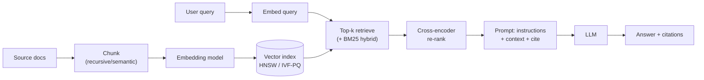
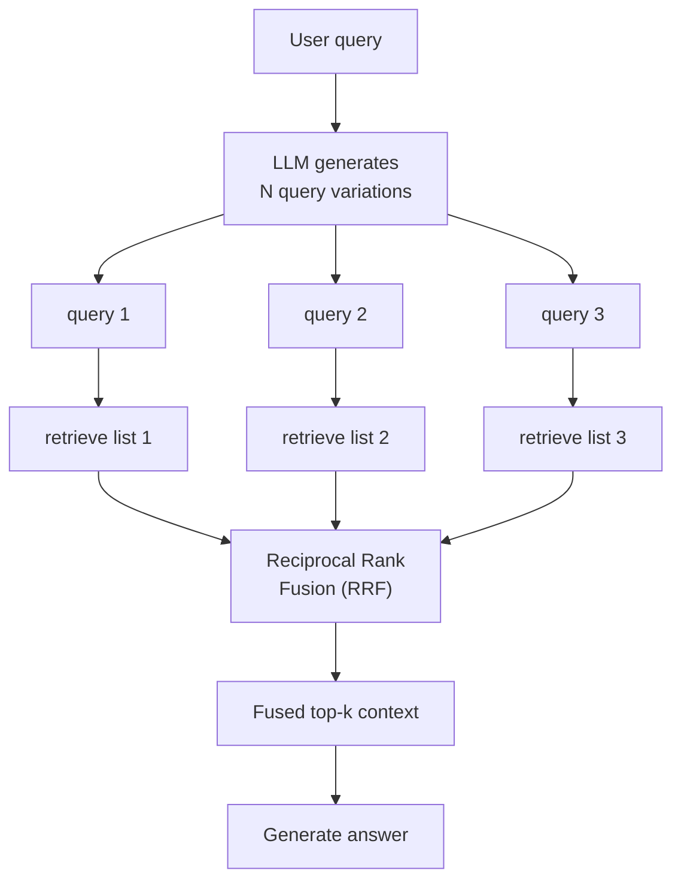
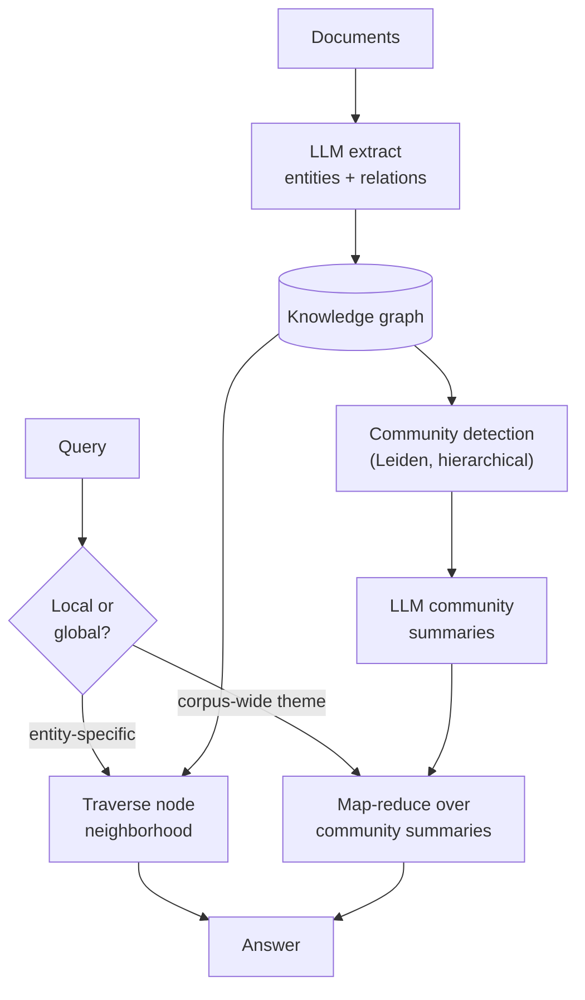
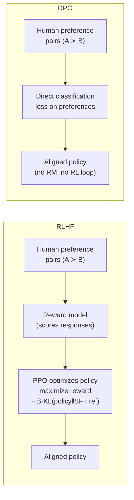
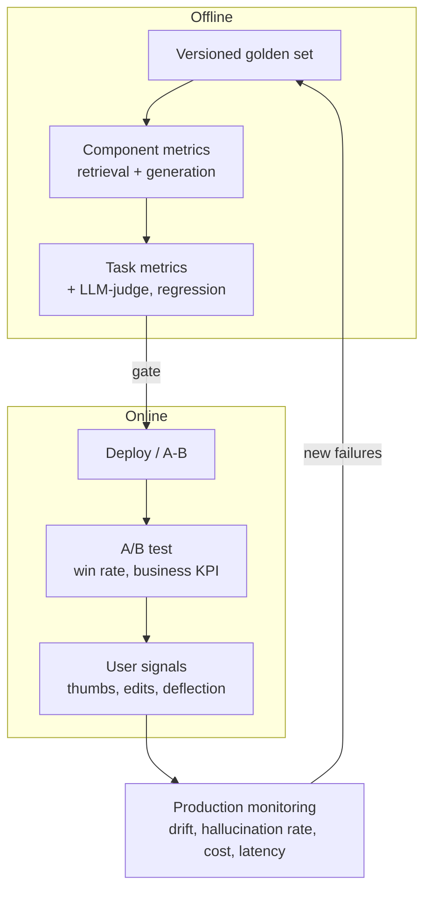

# LLM & GenAI — Interview Q&A (2026-07-22)

[← Back to index](../README.md) · [Cheat sheet](./cheatsheet.md)

> Depth + breadth across generative AI, RAG, RAG fusion, Knowledge Graphs, fine-tuning, and optimization — with a heavy weighting on **metrics, monitoring, and what a successful outcome looks like**. Answers assume strong DL/ML fundamentals and focus on mechanics, not vendor specifics.

**How to use the metrics thread:** almost every section ends with "how do you know it worked?" Interviewers here reward candidates who attach a *measurement* and a *comparison method* to every design choice. When in doubt, answer: (1) what offline metric, (2) what online/business metric, (3) how you'd compare two versions with statistical rigor.

---

## A. Generative AI & LLM foundations

### What is the difference between a generative and a discriminative model, and where do LLMs sit?

**TL;DR:** Discriminative models learn `p(y|x)` (a decision boundary); generative models learn to produce samples from `p(x)` or `p(x,y)`; an autoregressive LLM models `p(token | previous tokens)`.

A discriminative model (logistic regression, most CV classifiers) maps inputs to labels and cannot synthesize new data. A generative model learns the data distribution well enough to sample from it. An LLM is a generative model factorized autoregressively: it models the joint probability of a sequence as a product of conditional next-token distributions, `p(x₁..xₙ) = Π p(xₜ | x₁..xₜ₋₁)`. This is why the same objective (next-token prediction) yields translation, summarization, and reasoning — all are conditional generation. Coming from CV, the mental shift is that "classification" becomes "generate the label tokens," so the model's output space is the entire vocabulary at every step.

### Why are modern LLMs decoder-only transformers rather than encoder-decoder?

**TL;DR:** Decoder-only with causal masking unifies every task as next-token prediction, scales cleanly, and reuses one stack; encoder-decoder shines for fixed input→output mapping like translation.

The original transformer was encoder-decoder (encoder does bidirectional attention over the source, decoder attends to it plus its own prefix). Decoder-only models drop the separate encoder and use a single causal-masked stack where every token attends only to previous tokens. This is simpler to scale, lets any task be framed as "continue this sequence," and makes in-context learning natural because the prompt and the completion live in the same stream. Encoder-only (BERT) is great for embeddings/classification but can't generate; encoder-decoder (T5, BART) still wins when there's a clean source-to-target mapping. The field consolidated on decoder-only because generality + scale beat task-specific inductive bias.

### Explain self-attention and why its cost is quadratic in sequence length.

**TL;DR:** Each token computes query/key/value projections; attention weights are softmax over query·key dot products across all tokens, so an n-token sequence needs an n×n score matrix — O(n²) compute and memory.

For every token the model produces Q, K, V vectors. The attention score between token i and token j is `softmax(qᵢ·kⱼ / √d)`, and the output for token i is the weighted sum of all V vectors. Building the full score matrix for n tokens is n² dot products, which is why doubling context roughly quadruples attention cost and dominates long-context memory. This quadratic wall is the reason for FlashAttention (IO-aware exact attention that never materializes the full matrix in HBM), sparse/sliding-window attention, and KV caching at inference. Multi-head attention just runs several of these in parallel subspaces and concatenates, letting different heads specialize (syntax, coreference, position).

### What is autoregressive decoding, and what are the main sampling strategies?

**TL;DR:** Generate one token at a time, feeding each back in; control the distribution with temperature, top-k, and top-p (nucleus) sampling — greedy/beam for determinism, sampling for diversity.

At each step the model outputs a probability over the vocabulary; you pick a token, append it, and repeat. **Greedy** takes the argmax (deterministic, can be repetitive/bland). **Beam search** keeps the top-b partial sequences (good for MT/closed-form tasks, poor for open-ended text — it collapses to generic output). **Temperature** T rescales logits (`logit/T`): T<1 sharpens, T>1 flattens. **Top-k** samples from the k highest-probability tokens; **top-p / nucleus** samples from the smallest set whose cumulative probability ≥ p, adapting the candidate pool to the distribution's shape. In practice, low temperature + top-p is standard; you raise temperature for creative tasks and drop to ~0 (greedy) for extraction/classification where you want reproducibility.

### What is perplexity, what does it measure, and what are its limits as a metric?

**TL;DR:** Perplexity = exp(average cross-entropy) — the model's "surprise" per token; lower is better, but it only measures next-token likelihood on held-out text, not task quality, factuality, or helpfulness.

Perplexity is the exponential of the mean negative log-likelihood the model assigns to a held-out corpus; intuitively, the effective number of equally-likely choices the model is deciding among at each step. It's the natural intrinsic metric for a language model and correlates with general capability during pretraining. Its limits matter for interviews: it's tokenizer- and corpus-dependent (not comparable across models with different vocabularies), it rewards fitting the reference distribution rather than being correct or useful, and a model can have low perplexity yet hallucinate or fail instructions. So perplexity is a training/monitoring signal, never an acceptance metric for a product — you pair it with task and human/judge evaluation.

### What are the training stages of a modern instruction-following LLM?

**TL;DR:** Pretraining (next-token on web-scale text) → supervised fine-tuning / instruction tuning (demonstrations) → preference alignment (RLHF/DPO) → optional reasoning RL; each stage changes a different behavior.

**Pretraining** builds broad knowledge and language competence via self-supervised next-token prediction on trillions of tokens; this is where most "knowledge" lives. **SFT / instruction tuning** teaches the format of following instructions using curated (prompt, ideal response) pairs. **Alignment** (RLHF or DPO-family) optimizes for human *preferences* — helpfulness, harmlessness, tone — using comparison data, which base and SFT models can't learn from demonstrations alone. Newer models add a **reasoning-RL** stage (verifiable-reward RL) that rewards correct final answers to grow chain-of-thought. Knowing which stage fixes which failure is a common interview probe: missing knowledge → pretraining/RAG; wrong format → SFT; bad tone/unsafe → alignment; weak multi-step reasoning → reasoning RL.

### What do scaling laws tell us, and what is "compute-optimal" training?

**TL;DR:** Loss falls as a power law in parameters, data, and compute; Chinchilla showed most large models were undertrained — for a fixed compute budget, scale data and parameters together (~20 tokens per parameter).

Kaplan-style scaling laws found test loss decreases predictably as a power law of model size, dataset size, and compute. Chinchilla (Hoffmann et al., 2022) refined this: for a fixed FLOP budget there's an optimal balance, and earlier giant models were over-parameterized and under-fed on data — a compute-optimal model trains a smaller network on far more tokens (roughly 20 tokens/parameter). The practical consequences: (1) inference cost favors smaller-but-longer-trained models, (2) data quality/quantity is often the binding constraint, and (3) many "small" 2024–2026 models beat older larger ones by training on more and better data. For a CV person: it's the same "more data usually beats more parameters," but formalized with predictable exponents that let labs forecast returns before spending the compute.

### What limits context length, and how do long-context models extend it?

**TL;DR:** Attention's O(n²) cost and positional encoding generalization limit context; RoPE + position-interpolation/scaling, efficient attention, and better training extend it — but effective use degrades before the nominal limit.

Two things bound context: compute/memory (the quadratic attention and the linearly growing KV cache) and *positional generalization* (the model must handle positions it rarely saw in training). Rotary position embeddings (RoPE) encode relative position by rotating Q/K, and techniques like position interpolation, NTK-aware scaling, and YaRN stretch RoPE to longer windows with light fine-tuning. FlashAttention and paged KV caches make the memory tractable. The key interview nuance: **nominal ≠ effective** context — models show "lost in the middle" degradation and accuracy drop-off well before the advertised token limit, so you validate long-context claims with retrieval/needle-in-a-haystack tests on *your* task, not the spec sheet.

### What is in-context learning, and how does it relate to "emergent" abilities?

**TL;DR:** In-context learning is the model solving a task from examples in the prompt without weight updates; some capabilities appear to jump sharply with scale ("emergent"), though the sharpness is partly a metric artifact.

In-context learning (ICL) means a model conditions on demonstrations in the prompt (few-shot) and generalizes to a new query — no gradient steps, just pattern completion over the context. It's why prompt engineering works at all. "Emergent abilities" describe capabilities (multi-step arithmetic, instruction following) that are near-random at small scale and rise steeply past some size. A well-cited caveat (Schaeffer et al., 2023) is that some emergence is an artifact of discontinuous metrics (exact match) — switch to a smooth metric and the curve looks continuous. For interviews, the balanced answer: scale unlocks qualitatively new usable behavior, but be skeptical of "magic thresholds" and always check whether the metric, not the model, created the cliff.

### What are reasoning models and test-time compute, and why do they matter now?

**TL;DR:** Reasoning models (o1/o3, DeepSeek-R1-style) are trained to spend extra tokens "thinking" (long chain-of-thought) before answering; scaling *inference* compute buys accuracy on hard math/code/logic tasks, trading latency and cost.

Instead of only scaling training, these models learn — often via reinforcement learning with verifiable rewards — to generate long internal reasoning traces, self-check, and backtrack before committing to an answer. This is "test-time compute scaling": accuracy improves with more thinking tokens (sampling more, longer, or with search) rather than a bigger model. DeepSeek-R1 (Jan 2025) showed strong reasoning can emerge from pure RL on verifiable tasks. The metrics implication is important: you now measure not just answer quality but **cost/latency per solved problem**, and you decide *per query* whether to route to an expensive reasoning path — "reasoning effort" becomes a tunable knob you monitor and budget, not a fixed model property.

---

## B. RAG — core mechanics

### What is Retrieval-Augmented Generation, and when do you choose it over fine-tuning or long context?

**TL;DR:** RAG conditions generation on retrieved external documents; use it for fresh/changing knowledge, private corpora, and citations. Fine-tune for behavior/format; use long context for small cohesive inputs.

RAG pairs a retriever (search over an external knowledge base) with a generator (the LLM), so answers are grounded in supplied passages rather than only parametric memory. It's the right tool when knowledge changes frequently, is proprietary, is too large to fit in context, or when you need attribution/citations — all without retraining. **Fine-tuning** changes *how* the model behaves (style, format, task skill), not what facts it can access reliably, and is a poor way to inject volatile knowledge. **Long context** (stuff everything in the prompt) works for a small, cohesive document set but doesn't scale to large corpora, costs tokens per call, and still suffers lost-in-the-middle. The mature answer is "combine": RAG for knowledge, light fine-tuning for format/behavior, long context for the retrieved pack. Reference: Lewis et al., 2020 (RAG).

### Walk through the architecture of a basic RAG pipeline.

**TL;DR:** Offline: load → chunk → embed → index. Online: embed query → retrieve top-k (often hybrid) → re-rank → build prompt with context → generate with citations.

Offline you parse documents, split them into retrievable chunks, embed each chunk, and store vectors plus metadata in an index. Online you embed the query, retrieve the nearest chunks (ideally hybrid dense + lexical), optionally re-rank with a cross-encoder, and inject the top few into a prompt template that instructs the model to answer only from context and cite sources. Optional layers — query rewriting, metadata filters, post-generation verification — wrap this core. Every arrow is a place to measure: retrieval quality (did we fetch the right chunks?) and generation quality (did we use them faithfully?).

### What are the main chunking strategies, and how do you pick chunk size?

**TL;DR:** Fixed-size (fast, naive), recursive (respects separators), semantic (groups by meaning), and structural/parent-child; pick by content type and evaluate empirically — 256–1024 tokens with 10–20% overlap is a common start.

**Fixed-size** slices every N tokens with overlap — simple but breaks sentences. **Recursive** splits on a separator hierarchy (paragraph → sentence → token) preserving structure — the sensible default. **Semantic** chunking merges adjacent sentences while embedding similarity stays high, producing topically coherent chunks at extra compute. **Structural** uses headings/layout; **parent-child (small-to-big)** retrieves small precise chunks but feeds the larger parent to the LLM. Size is a recall-vs-completeness tradeoff: small chunks localize the answer (better retrieval precision) but may lack context; large chunks are self-contained but dilute embeddings and worsen lost-in-the-middle. There is no universal size — you benchmark on a labeled retrieval set for your corpus. The reflexive interview answer: "start recursive ~512 tokens/15% overlap, then tune against context recall."

### How do embedding models turn text into vectors, and how are they trained?

**TL;DR:** A transformer encoder maps text to a fixed-dimension dense vector (via pooling) such that semantically similar texts are close (cosine); trained with contrastive objectives on positive/negative pairs with hard-negative mining.

The encoder tokenizes text, runs it through transformer layers, and pools token states (CLS, mean, or last-token) into one vector of typically 384–4096 dims. Training uses contrastive learning: pull query/positive-document pairs together and push negatives apart (InfoNCE loss), with hard negatives (plausible-but-wrong passages) being crucial for quality. Data comes from query-document pairs, NLI, and increasingly LLM-generated synthetic pairs. The result supports approximate nearest-neighbor retrieval where wording differs but meaning matches. Note the asymmetry: many models use different instructions/prefixes for "query" vs "document" embeddings, and cosine similarity (not Euclidean) is the usual metric because vectors are normalized.

### How do you choose an embedding model, and what's the operational catch?

**TL;DR:** Pick by domain fit, language, dimension, max sequence length, and license; start from MTEB/BEIR but re-benchmark on your data. The catch: changing the model means re-embedding the entire corpus.

Leaderboards (MTEB, BEIR) are a starting filter, not a decision — always re-evaluate on a held-out set of *your* queries and documents, because domain shift (legal, code, biomedical) reorders rankings. Weigh dimension (storage + ANN latency), max context (must exceed your chunk size), multilingual needs, and hosted-vs-open-source (cost, data residency, ability to fine-tune). The operational catch interviewers look for: embeddings are not interchangeable — swapping models (or even versions) invalidates every stored vector, forcing a full, potentially expensive re-embed and re-index, so you version your embedding model alongside your index and plan migrations.

### How does approximate nearest-neighbor search work (HNSW, IVF-PQ), and what's the tradeoff?

**TL;DR:** ANN trades exactness for speed. HNSW builds a navigable multi-layer graph (fast, memory-heavy); IVF partitions space into clusters and searches a few, with PQ compressing vectors. The knob is recall vs latency/memory.

Exact search over millions of vectors is too slow, so ANN indexes approximate it. **HNSW** builds a hierarchical small-world graph: search greedily descends layers hopping to closer neighbors; parameters `M` (graph degree), `efConstruction`, and `efSearch` trade recall for build time/latency/memory. **IVF** clusters vectors (via k-means) into cells and, at query time, probes only the `nprobe` nearest cells; **PQ (product quantization)** compresses each vector into subspace codebook codes, shrinking memory ~8–32× at some recall cost. **DiskANN** pushes this to SSD for billion-scale. The universal tradeoff: higher recall (search more of the graph/more cells, less compression) costs latency and memory — so you tune to hit a target recall@k at your latency budget, and you *measure* recall against exact search on a sample.

### What is hybrid search and why does it usually beat pure vector search?

**TL;DR:** Hybrid fuses lexical (BM25) and dense retrieval; BM25 nails exact terms/codes/rare jargon that embeddings miss, dense catches paraphrase — fused (often via RRF), they're more robust across query types.

Dense vectors excel at semantic/paraphrase matching but can miss exact tokens: product codes, error strings, names, acronyms, and rare domain jargon that a lexical BM25 index retrieves trivially. Hybrid runs both retrievers and fuses their result lists — commonly Reciprocal Rank Fusion (rank-based, no score calibration needed) or weighted normalized scores. The payoff is robustness: keyword-heavy lookups and conceptual questions both work. Costs are extra index maintenance and fusion-weight tuning. In practice hybrid + a cross-encoder re-ranker is the strong default RAG retrieval stack.

### What is re-ranking, and why is it often the highest-ROI RAG upgrade?

**TL;DR:** A second-stage cross-encoder scores each (query, passage) pair jointly with full attention, fixing the imprecision of first-stage bi-encoders/BM25 — big precision@k gains on a small candidate set.

First-stage retrieval is fast because it compares independent embeddings (bi-encoder) or term stats (BM25), but that independence misses fine-grained query-document interactions. A **cross-encoder re-ranker** takes the top 20–100 candidates and runs the query and each passage *together* through a transformer, producing a much more accurate relevance score — at linear cost, so you only apply it to the shortlist, not the whole index. It typically gives the largest single jump in answer quality after hybrid search, because getting the truly relevant chunk into the top 3–5 both improves faithfulness and mitigates lost-in-the-middle. Newer "listwise" LLM re-rankers push quality further at higher cost.

### What is the "lost in the middle" problem?

**TL;DR:** LLMs recall information best at the very start and end of the context and often ignore relevant content buried in the middle — a U-shaped attention bias — so more context isn't automatically better.

Empirical work (Liu et al., 2023) shows a U-shaped performance curve: put the key passage at the beginning or end and the model uses it; put it in the middle of a long context and accuracy drops, sometimes below shorter-context baselines. This means cramming top-k=50 chunks in can *hurt*. Mitigations: retrieve fewer but better chunks (strong re-ranking), order the most relevant chunk first or last, compress/summarize middle content, and prefer small well-ordered context over large unordered. It's a direct argument for why retrieval precision and re-ranking matter more than raw recall past a point.

### What are the common failure modes of a RAG system, and where do they originate?

**TL;DR:** Failures split into retrieval (wrong/missing chunks) and generation (hallucinating beyond context, ignoring context). Also: bad chunking, weak embeddings, stale data, jargon mismatch, and unverified citations.

The single most useful diagnostic frame is **retrieval vs generation**: if the right chunk was never retrieved, no prompt engineering saves you (fix chunking, embeddings, hybrid, re-ranking); if the chunk was retrieved but the answer is wrong, the generator is hallucinating or ignoring context (fix prompt, grounding instructions, model, or add verification). Other recurring modes: chunk size mismatched to content, embedding model wrong for the domain, stale index (no incremental re-ingest), lexical misses on codes/jargon, lost-in-the-middle from over-stuffing, and LLM-fabricated citations that don't map to real spans. This retrieval/generation decomposition is exactly why RAG metrics are split into context precision/recall (retrieval) and faithfulness/answer-relevance (generation) — so you know which half to fix.

---

## C. RAG fusion & advanced retrieval

### What is RAG-Fusion, and how does it differ from vanilla RAG?

**TL;DR:** RAG-Fusion generates several reformulations of the user query, retrieves for each in parallel, then fuses the multiple ranked lists with Reciprocal Rank Fusion into one consensus ranking before generation — improving recall and robustness to query phrasing.

Vanilla RAG embeds a single query and retrieves once, so a poorly phrased or ambiguous query yields poor retrieval. RAG-Fusion asks the LLM to produce multiple related queries (synonyms, sub-aspects, different framings), retrieves a ranked list for each, and combines those lists with RRF so documents that rank well across *several* query variants float to the top. This adds recall (different phrasings surface different relevant chunks), reduces sensitivity to the exact wording, and provides a mild consensus/denoising effect. Costs: extra LLM calls to generate queries and extra retrievals, plus the risk that off-topic query variants inject noise. Reference: Rackauckas, 2024 (RAG-Fusion).

### Explain Reciprocal Rank Fusion — the formula and why it's used.

**TL;DR:** RRF scores each document by summing `1/(k + rank)` across all result lists (k≈60), so rank position, not raw score, drives fusion — robust because it needs no score normalization across heterogeneous retrievers.

For a document d appearing at rank `rᵢ` in list i, RRF assigns `score(d) = Σᵢ 1/(k + rᵢ)`, where k is a constant (commonly 60) that damps the influence of top ranks so a few lists can't dominate. Documents that appear near the top of *multiple* lists accumulate the highest fused score. The reason it's the default fusion method: it's rank-based, so you can combine a dense retriever (cosine scores), BM25 (TF-IDF-ish scores), and query variants without the nightmare of calibrating incomparable score scales. It's simple, parameter-light, and empirically strong (Cormack et al., 2009). The k constant is the main knob — smaller k sharpens toward top ranks, larger k flattens.

### RAG-Fusion vs multi-query retrieval vs hybrid search — how do they relate?

**TL;DR:** Multi-query = generate query variants and union results; RAG-Fusion = multi-query *plus RRF* to rank the union; hybrid = fuse *different retrievers* (dense + lexical) on the *same* query. They're composable, not competing.

All three attack retrieval robustness from different angles. **Multi-query** expands one query into several and pools the retrieved documents (often just deduped). **RAG-Fusion** is multi-query with a principled fusion step (RRF) so the pooled documents are *re-ranked* by cross-query consensus rather than dumped together. **Hybrid search** fuses heterogeneous *retrievers* (BM25 + dense) for a single query to cover both lexical and semantic matches. You can stack them: run hybrid retrieval for each of several generated query variants and RRF-fuse everything, then cross-encoder re-rank the top. The interview point is knowing that "fusion" can happen over query variants, over retriever types, or both — and that RRF is the common glue.

### What is HyDE (Hypothetical Document Embeddings)?

**TL;DR:** HyDE asks the LLM to draft a hypothetical answer/document for the query, embeds *that* instead of (or alongside) the query, and retrieves — because a fake answer lives closer in embedding space to real answer passages than the short question does.

Short queries and their answer passages can be far apart in embedding space (question phrasing ≠ document phrasing). HyDE (Gao et al., 2022) has the LLM generate a plausible answer document — even if factually imperfect — then embeds that richer text to retrieve real documents with similar content. It's a zero-shot way to bridge the query-document vocabulary gap without training a better embedder. Downsides: an extra LLM call's latency, and if the hallucinated document drifts off-topic it can steer retrieval wrong, so it helps most on knowledge-heavy queries and less on simple keyword lookups. It composes with RAG-Fusion (generate multiple hypothetical docs).

### How do you handle multi-hop questions that need evidence from several documents?

**TL;DR:** Decompose the query into sub-questions, retrieve per hop, and chain — via iterative retrieve-read-re-query loops, agentic RAG, or graph traversal (GraphRAG) — then aggregate evidence with citations.

A single retrieval rarely satisfies "which company did the CEO of X's former employer acquire?" — the facts live in different documents and one depends on the answer to another. Approaches: **query decomposition** (LLM rewrites into ordered sub-queries), **iterative retrieval** (retrieve, read, formulate the next query from what you learned), **agentic RAG** (an LLM loop decides when/what to retrieve and stops when it has enough), and **graph-based** methods that traverse entity relations. You then aggregate — concatenate evidence or have the agent reason step-by-step with per-hop citations. Crucially, you must *evaluate on multi-hop datasets* (HotpotQA-style) because single-hop metrics hide these failures.

### What is Contextual Retrieval, and what problem does it solve?

**TL;DR:** Before embedding, prepend an LLM-generated context blurb to each chunk that situates it within its source document; this fixes chunks that lose meaning when isolated, improving retrieval — pair contextual embeddings with contextual BM25.

A chunk like "the margin rose 3%" is uninterpretable alone — which company, which quarter? Contextual Retrieval (Anthropic, Sept 2024) uses an LLM to generate a short document-aware description for each chunk ("This is from ACME's Q2 2025 10-Q, discussing gross margin...") and prepends it before embedding *and* before building the BM25 index. This preserves the context that naive chunking destroys, materially reducing retrieval failures: Anthropic reported the top-20 retrieval-failure rate dropping ~35% with contextual embeddings, ~49% adding contextual BM25, and ~67% with re-ranking on top. It combines well with re-ranking. The cost is a one-time LLM pass over the corpus at ingest (mitigated by prompt caching), and it's a strong, cheap-at-query-time upgrade — a good "what would you try next" answer when chunk-level ambiguity is the bottleneck.

### What are Self-RAG and Corrective RAG (CRAG)?

**TL;DR:** Both make RAG adaptive. Self-RAG trains the model to emit reflection tokens deciding when to retrieve and whether evidence supports its claims; CRAG grades retrieved docs and triggers corrective actions (e.g., web search) when retrieval looks weak.

**Self-RAG** (Asai et al., 2023) fine-tunes the LLM to generate control tokens — decide `[Retrieve]` or not, then grade each passage for relevance and whether the answer is supported/useful — so retrieval becomes on-demand and answers carry self-critique, skipping retrieval on easy questions and verifying support on factual ones. **CRAG** (Corrective RAG) adds a lightweight retrieval evaluator that labels the retrieved set as correct/ambiguous/incorrect and takes corrective action: keep, decompose-and-refine, or fall back to web search, before generating. Both reflect the 2024–2025 trend of moving quality control *inside* the loop (grade evidence, act on it) rather than blindly retrieve-then-generate. They raise faithfulness at the cost of extra steps.

### Long context vs RAG — is RAG obsolete now that context windows are huge?

**TL;DR:** No. Long context suits small, cohesive inputs and reasoning that needs all facts at once; RAG wins on scale, freshness, access control, citations, and cost. In practice you combine them (retrieve, then stuff a large pack with prompt caching).

As context windows grew, the "just put everything in the prompt" argument returned. Reality is nuanced: long context is great when the relevant material is bounded and you need holistic reasoning over it, but it doesn't scale to millions of documents, pays tokens on every call (expensive at volume), still degrades with lost-in-the-middle, and can't enforce per-user access control or give precise citations. Recent evidence sharpens the caution: Chroma's *Context Rot* study (2025) found that all 18 frontier models tested degrade non-uniformly well before their advertised window — meaningful accuracy drops appeared around ~50K tokens on a 200K-token model, worse with distractors — so effective context is far shorter than nominal, and single-needle "needle-in-a-haystack" tests overstate real long-context ability. RAG scales to arbitrary corpora, updates incrementally (freshness), filters by ACL/metadata, and cites specific chunks. The mature pattern is hybrid: retrieve a generous candidate set, then use long context to reason over a re-ranked pack, leveraging prompt caching to control cost. "It depends on corpus size, freshness, cost, and attribution needs" is the answer they want.

### How do you know RAG-Fusion (or any retrieval change) actually helped?

**TL;DR:** Isolate retrieval with a labeled set and measure recall@k / context recall / nDCG / MRR before and after; then confirm the downstream lift in faithfulness and answer correctness. Guard against added latency and noise-injection.

Retrieval upgrades must be evaluated at the retrieval layer first, because end-to-end answer metrics blur cause. Build a gold set of (query → relevant chunk IDs) and compare **recall@k**, **context recall**, **nDCG**, and **MRR** with vs without the change — RAG-Fusion should raise recall/robustness across varied phrasings. Then verify the change propagates to generation: does **faithfulness** and **answer correctness** improve on your eval set, or did the extra retrieved variants inject noise that lowered precision and triggered lost-in-the-middle? Also track the cost side: RAG-Fusion adds LLM calls and latency, so you weigh the quality delta against p95 latency and cost/query. The disciplined story — "measure the layer you changed, then confirm it survives to the answer, then check it's worth the latency" — is exactly the metrics maturity this interviewer is probing.

---

## D. Knowledge Graphs & GraphRAG

### What is a knowledge graph, and why combine one with an LLM?

**TL;DR:** A knowledge graph stores facts as (entity, relation, entity) triples in a graph; pairing it with an LLM gives explicit, verifiable, multi-hop-traversable structure that grounds answers and reduces hallucination where relationships matter.

A KG represents knowledge as nodes (entities: people, companies, genes) and typed edges (relations: works_at, acquired, interacts_with), often with attributes — think a queryable graph of facts rather than free text. LLMs are strong at language but store knowledge implicitly and fuzzily; a KG makes relationships explicit, queryable (e.g., Cypher/SPARQL), and auditable. Combining them helps when questions are *relational* or *multi-hop* ("what connects A and D through intermediates?"), when you need provenance, or when you want to constrain generation to known facts. The LLM contributes language understanding and extraction; the graph contributes precise, connectable structure. This is the backbone of GraphRAG and KG-grounded QA.

### How do you construct a knowledge graph from unstructured text?

**TL;DR:** LLM-driven pipeline: extract entities (NER), resolve/dedupe them (entity resolution), extract typed relations between them, normalize to a schema/ontology, and load triples into a graph store — then keep it updated incrementally.

The modern approach uses an LLM to read chunks and emit structured (subject, relation, object) triples plus entity types, replacing brittle rule/regex extractors. Key steps: **entity extraction** (find mentions), **entity resolution/coreference** (merge "IBM", "I.B.M.", "International Business Machines" into one node — the hardest and most error-prone step), **relation extraction** (typed edges, ideally constrained to an ontology so the graph stays consistent), **canonicalization** (normalize dates, units, names), and **loading** into a graph DB. You also attach provenance (source chunk) to each triple for auditability. Challenges: extraction precision/recall, schema drift, conflicting facts, and scale — which is why evaluation of the *graph itself* (triple precision/recall against a gold set) matters before you trust downstream QA.

### What is GraphRAG (Microsoft), and how do local and global search differ?

**TL;DR:** GraphRAG builds a KG from documents, clusters it into communities, and pre-summarizes each community. **Local search** answers entity-specific questions by traversing neighborhoods; **global search** answers corpus-wide "what are the themes" questions by map-reducing over community summaries.

GraphRAG (Edge et al., 2024) addresses questions vector RAG handles poorly — broad, sensemaking queries like "what are the main themes across these reports?" — that no single chunk answers. It extracts a graph, runs hierarchical community detection to group related entities, and has the LLM write a summary per community offline. **Global search** answers holistic questions by running the query against many community summaries in parallel (map) and combining partial answers (reduce). **Local search** answers "tell me about entity X" by pulling X's neighborhood, related entities, and their source text. The tradeoff is heavy, expensive offline indexing (many LLM calls) in exchange for capabilities vector RAG lacks.

### How does community detection fit into GraphRAG, and why summarize communities?

**TL;DR:** Community detection (e.g., the Leiden algorithm) partitions the graph into densely-connected clusters of related entities; summarizing each community once, offline, lets global queries reason over a few hundred summaries instead of millions of chunks.

Graphs have modular structure — subsets of entities that reference each other far more than the rest (a product line, a research subfield). The Leiden algorithm (an improvement over Louvain) finds these communities efficiently and hierarchically, so you get nested clusters at multiple resolutions. GraphRAG then uses the LLM to write a natural-language summary of each community (its key entities, relationships, and claims) as a pre-computation. This is the trick that makes *global* sensemaking tractable: instead of stuffing or scanning the whole corpus at query time, you map the question over a manageable set of community summaries and reduce their partial answers. It trades expensive one-time indexing for cheap, corpus-spanning query answering.

### When does GraphRAG beat vector RAG, and when is it overkill?

**TL;DR:** Use graph approaches for multi-hop, relational, and global/sensemaking questions over a fairly stable corpus. Stick with vector RAG for direct factual lookup, frequently-changing data, and when indexing cost/complexity isn't justified.

GraphRAG shines when answers require *connecting* many pieces — multi-hop reasoning, "how are these related," aggregating themes across a whole corpus — because explicit relations and community summaries capture structure that independent chunk embeddings can't. It's overkill (and expensive) when queries are direct lookups ("what's the refund policy?") that a single chunk answers, when the corpus changes constantly (graph re-extraction is costly), or when you lack the budget for the heavy LLM-based indexing and maintenance. Many production systems go **hybrid**: vector RAG for most queries, graph traversal for the relational/global subset, routing by query type. The honest interview answer names the cost: GraphRAG's power comes with real indexing expense and pipeline complexity.

### How do you query a knowledge graph with an LLM (text-to-query)?

**TL;DR:** The LLM translates a natural-language question into a formal graph query (Cypher/SPARQL/Gremlin) against the schema, executes it, and verbalizes the structured results — precise and verifiable, but bounded by schema coverage and translation accuracy.

For KG-grounded QA over a structured graph, a common pattern is **text-to-Cypher** (or text-to-SPARQL): you give the LLM the graph schema and few-shot examples, it generates a query, you run it, and the LLM narrates the returned rows/subgraph. This gives exact, auditable answers for relational questions ("list all suppliers two hops from X") that fuzzy retrieval can't guarantee, and the executed query is inspectable. Risks: the LLM can hallucinate non-existent node/edge types, generate invalid or unsafe queries, or miss when the schema can't express the question — so you constrain with schema grounding, validate/parametrize queries, and fall back gracefully. It's essentially the RAG idea applied to structured stores instead of text chunks.

### What are lighter-weight graph-RAG variants like LightRAG and HippoRAG?

**TL;DR:** They aim for GraphRAG-style relational reasoning at lower cost. LightRAG uses dual-level (local + global) graph retrieval with incremental updates; HippoRAG uses a graph + personalized PageRank to mimic associative memory for multi-hop retrieval.

Microsoft GraphRAG's weakness is expensive indexing and costly global search. **LightRAG** (2024) builds an entity-relation graph but retrieves with a dual-level scheme (fine-grained entity queries + higher-level topic queries) and supports incremental insertion, cutting cost and enabling updates without full re-index. **HippoRAG / HippoRAG 2** (2024–25) is inspired by hippocampal memory: it builds a KG and runs Personalized PageRank from the query's entities to spread activation across related nodes, retrieving multi-hop-relevant passages in a *single* step rather than iterative LLM loops (much cheaper/faster than iterative retrieve-reason chains). Microsoft itself answered the cost problem with **LazyGraphRAG** (late 2024), which defers *all* LLM calls to query time — no pre-built community summaries — reportedly matching global-search quality at orders-of-magnitude lower query cost; **DRIFT search** seeds local search with community context, and **PathRAG** prunes to key relational paths to cut noise and tokens. The theme across 2024–2026 variants is getting graph-structured, multi-hop retrieval quality while reducing the indexing/query cost and adding incremental freshness — the two things basic GraphRAG struggles with.

### How do you evaluate a GraphRAG or KG-backed system?

**TL;DR:** Evaluate three layers: graph construction (triple precision/recall, entity-resolution accuracy vs a gold graph), retrieval (did traversal fetch the right evidence), and generation (faithfulness, correctness) — plus multi-hop and global-sensemaking test sets, since those are the point.

Because a graph pipeline has more moving parts, you measure each. **Construction:** sample extracted triples and score precision/recall against human-labeled gold triples, and measure entity-resolution quality (are duplicates merged, distinct entities kept separate) — errors here poison everything downstream. **Retrieval/traversal:** for local search, standard recall@k / context recall on the fetched subgraph; for global search, whether the right communities were selected. **Generation:** faithfulness and answer correctness as in normal RAG, but you specifically need **multi-hop** eval sets (HotpotQA, MuSiQue, 2WikiMultiHopQA — EM/F1/Recall@k) and **global/sensemaking** sets (LLM-judged pairwise on comprehensiveness, diversity, empowerment — the metrics Microsoft's GraphRAG paper reports) because those are exactly the capabilities GraphRAG claims and single-hop metrics won't reveal. Claim-level tools like **RAGChecker** separate retrieval vs generation errors at the individual-claim level. Also track the cost/latency of indexing and query, since that's GraphRAG's main downside.

### How would you combine a knowledge graph with vector RAG?

**TL;DR:** Route or blend: use vector search for semantic passage lookup and the KG for relational/structured constraints and multi-hop expansion — e.g., retrieve chunks, expand via graph neighbors, and fuse; or filter vector results by graph-derived metadata.

Hybrid KG + vector systems play to each strength. Patterns: (1) **graph-augmented retrieval** — retrieve seed chunks by vector search, then walk the KG to pull related entities/passages that pure similarity would miss (great for multi-hop); (2) **structured filtering** — use the graph for hard constraints (entity type, relationship, recency, ACL) and vectors for semantic ranking within that filtered set; (3) **query routing** — classify the query and send lookups to vectors, relational/aggregate questions to the graph (text-to-Cypher); (4) **fusion** — RRF-combine vector hits and graph-traversal hits. The design principle: vectors handle "what's semantically similar," the graph handles "what's explicitly connected," and you fuse or route based on the query's nature. Evaluate the combined system on both single-hop and multi-hop sets to confirm the graph adds value beyond vectors alone.

---

## E. Fine-tuning & alignment

### When should you fine-tune vs use RAG vs just prompt-engineer?

**TL;DR:** Prompt first (cheapest, fastest to iterate); RAG for knowledge/freshness/citations; fine-tune to change *behavior* — format, style, tone, a narrow skill, or to compress a long prompt. They're complementary, not either/or.

Order of escalation by cost and effort: **prompt engineering** (few-shot, instructions, structured output) is instant and reversible — always try it first. **RAG** solves *knowledge* problems: the model lacks facts, facts change, or you need citations and access control. **Fine-tuning** solves *behavior* problems: consistent output format/JSON, a specific tone/persona, a specialized classification/extraction skill, following instructions the base model resists, or baking in a long system prompt to cut per-call tokens. A classic mistake is fine-tuning to inject volatile knowledge — it's expensive, fuzzy, and stale on the next update; RAG does that better. The strong answer: "diagnose whether the gap is knowledge (RAG), behavior (fine-tune), or just prompting; often combine — fine-tune for format, RAG for facts."

### Distinguish pretraining, continued pretraining, SFT, and alignment.

**TL;DR:** Pretraining = self-supervised next-token on huge corpora (broad knowledge). Continued pretraining = more of that on domain text (inject domain distribution). SFT = supervised (prompt→response) demonstrations (task/format). Alignment = preference optimization (helpful/harmless behavior).

**Pretraining** creates the base model's language and world knowledge from raw text via next-token prediction — no labels, enormous scale. **Continued (domain-adaptive) pretraining** runs more unsupervised training on a target domain's raw text (legal, biomedical, code) to shift the model's distribution toward that domain; useful when the domain vocabulary/patterns are underrepresented, but risks forgetting. **SFT** uses curated instruction-response pairs to teach the model to follow instructions and produce desired formats — it imitates demonstrations. **Alignment** (RLHF/DPO-family) goes beyond imitation to optimize for *preferences* the model can't learn from single demonstrations — choosing the more helpful/safe of two responses. Each targets a different gap, and you pick the stage matching your failure mode.

### Full fine-tuning vs parameter-efficient fine-tuning (PEFT) — trade-offs?

**TL;DR:** Full FT updates all weights (max capacity, max cost, catastrophic-forgetting risk, one full model per task). PEFT (LoRA etc.) freezes the base and trains a tiny set of new parameters — ~99% cheaper memory, swappable adapters, minimal forgetting, slight quality ceiling.

Full fine-tuning updates every parameter: it has the most capacity to change behavior and can be necessary for large distribution shifts, but it needs optimizer state for billions of parameters (huge GPU memory), produces a full-size checkpoint per task, and readily overwrites general capabilities (catastrophic forgetting). **PEFT** freezes the pretrained weights and trains a small number of additional parameters (LoRA adapters, prefixes), slashing memory and storage, letting you keep many task-specific adapters over one shared base, and largely preserving general skills. The cost is a modest quality gap on some hard tasks and rank/placement tuning. For most applied work — especially with limited GPUs — LoRA/QLoRA is the default, and you reserve full FT for cases where PEFT plateaus below requirements.

### How does LoRA work?

**TL;DR:** LoRA freezes the pretrained weight W and learns a low-rank update ΔW = B·A (rank r ≪ dimension), so you train only the small A and B matrices; at inference the update can be merged into W with zero added latency.

The insight is that the weight *update* needed to adapt a model has low intrinsic rank. Instead of learning a full dense ΔW for a layer, LoRA (Hu et al., 2021) parameterizes it as the product of two thin matrices, B (d×r) and A (r×k), with r typically 8–64. Only A and B are trained; the base W stays frozen, so optimizer memory scales with the tiny adapter, not the model. A scaling factor α/r controls the update's magnitude. Because ΔW = BA is just a matrix you can add to W, you can **merge** the adapter for zero inference overhead or keep it separate to hot-swap tasks. LoRA is usually applied to attention projection matrices (and often MLPs). It's the workhorse of practical fine-tuning: cheap, effective, composable.

### What does QLoRA add, and how does it enable single-GPU fine-tuning?

**TL;DR:** QLoRA fine-tunes LoRA adapters on top of a base model quantized to 4-bit (NF4), using double quantization and paged optimizers, so a large model fits in one consumer/prosumer GPU with near-full-precision quality.

QLoRA (Dettmers et al., 2023) combines LoRA with aggressive base-model quantization to collapse memory further. Its ingredients: **4-bit NormalFloat (NF4)** — a data type optimal for the roughly-normal distribution of weights; **double quantization** — quantizing the quantization constants themselves to save more memory; and **paged optimizers** — offloading optimizer state to CPU to survive memory spikes. The base weights are stored in 4-bit and de-quantized on the fly for the forward/backward pass, while gradients flow only into the small 16-bit LoRA adapters. The result: fine-tune a 30–70B model on a single GPU with minimal quality loss versus 16-bit fine-tuning. It democratized fine-tuning and is a standard interview touchstone for "how do you fine-tune when GPU-poor."

### What are newer PEFT methods like DoRA, and why do they exist?

**TL;DR:** They push PEFT quality closer to full fine-tuning. DoRA decomposes weights into magnitude and direction and applies LoRA to the direction, improving learning stability and accuracy over vanilla LoRA at similar cost.

Vanilla LoRA occasionally underperforms full fine-tuning because a single low-rank update entangles how much a weight changes with how its direction changes. **DoRA (Weight-Decomposed Low-Rank Adaptation, 2024)** splits each weight into a magnitude scalar and a direction vector, keeps a learnable magnitude, and uses LoRA only for the directional update — this better mirrors full fine-tuning's learning dynamics and improves accuracy, especially at low ranks, with negligible extra inference cost after merging. Other variants tune rank allocation (AdaLoRA), initialization (PiSSA), or quantization interplay. The meta-point for interviews: PEFT is an active area closing the gap to full FT, and knowing *why* (LoRA's coupling of magnitude/direction, rank allocation) signals depth beyond "I use LoRA."

### What is instruction tuning, and why is it necessary?

**TL;DR:** Instruction tuning is SFT on diverse (instruction, response) pairs across many tasks, teaching a base model to follow natural-language instructions and generalize to unseen ones — turning a text-completer into a usable assistant.

A raw pretrained model completes text but doesn't reliably "do what you ask" — prompt it with a question and it might continue with more questions. Instruction tuning fine-tunes it on many tasks phrased as instructions with ideal responses (summarize, translate, classify, reason), which teaches the *behavior* of instruction-following and, importantly, generalizes to instructions not seen in training. This is the bridge from base model to chat/assistant model and a prerequisite for zero-shot usefulness and later alignment. Data quality and diversity matter more than sheer volume — a few thousand high-quality, varied examples often beat a noisy million. It's the "format/behavior" layer that RAG and prompting sit on top of.

### Explain RLHF — the reward model, PPO, and the KL penalty.

**TL;DR:** Collect human preference comparisons, train a reward model to score responses, then optimize the LLM (policy) with RL (PPO) to maximize reward — with a KL penalty keeping it close to the SFT reference so it doesn't degenerate or "reward-hack."

RLHF has three steps: (1) SFT a base model; (2) gather human comparisons (given a prompt, which of two responses is better) and train a **reward model** to predict that preference as a scalar score; (3) use RL — typically **PPO** — to update the LLM so its sampled responses score higher under the reward model. The critical detail is the **KL-divergence penalty**: the objective is `reward − β·KL(policy‖reference)`, which keeps the tuned policy near the SFT reference. Without it the policy drifts into gibberish or degenerate text that games the reward model (reward hacking) and loses fluency. RLHF is powerful but complex and unstable — four models in memory (policy, reference, reward, value), sensitive hyperparameters — which is exactly what DPO tries to avoid.

### What is DPO, and how does it avoid the RL loop?

**TL;DR:** Direct Preference Optimization reframes alignment as a simple classification loss on preference pairs — it derives a closed form where the optimal policy *is* the reward, so you directly increase the log-prob margin of preferred over rejected responses. No reward model, no PPO, no sampling loop.

DPO (Rafailov et al., 2023) starts from the same RLHF objective but shows the reward-maximization-with-KL problem has an analytic solution linking the optimal policy to the reward. Substituting that in, the reward model cancels out and you're left with a supervised-style loss: for each (prompt, chosen, rejected) triple, increase the model's log-probability of the chosen response relative to the rejected one, scaled by a temperature β, all measured against a frozen reference model. This is dramatically simpler and more stable than PPO — two models instead of four, standard supervised training, no reward-model training or online sampling. It became the default alignment method for many teams. Trade-offs: it needs good preference data, can overfit/over-optimize, and lacks the online exploration that PPO-style RL provides — motivating the variants below.

### Compare the preference-optimization variants: IPO, KTO, ORPO, SimPO.

**TL;DR:** They tweak DPO's loss or data needs. IPO fixes DPO's overfitting to deterministic preferences; KTO learns from single-signal (good/bad) labels instead of pairs; ORPO folds preference optimization into SFT (one stage, no reference model); SimPO drops the reference model using length-normalized reward.

- **IPO (Identity Preference Optimization):** DPO can overfit when preferences are near-deterministic, pushing the margin to extremes and ignoring the KL constraint; IPO adds a regularization that targets a bounded margin, improving stability.
- **KTO (Kahneman-Tversky Optimization):** Instead of *paired* comparisons, KTO uses *unpaired* binary labels ("this output was good/bad"), grounded in prospect-theory utility. This is huge operationally because thumbs-up/down production feedback is far easier to collect than curated pairs.
- **ORPO (Odds Ratio Preference Optimization):** Combines SFT and preference optimization in a *single* stage with an odds-ratio penalty on rejected responses — no separate reference model and no separate alignment phase, simplifying the pipeline.
- **SimPO:** Removes the reference model entirely and uses the average log-probability (length-normalized) as an implicit reward with a target margin, which is simpler and reduces DPO's length bias.

The through-line: reduce data burden (KTO), stages/models (ORPO, SimPO), or instability (IPO). Knowing *what each fixes* matters more than the equations.

### What is GRPO, and how is it used in reasoning-model (DeepSeek-R1-style) training?

**TL;DR:** Group Relative Policy Optimization is a PPO variant that drops the value/critic model — it samples a *group* of responses per prompt and uses their mean reward as the baseline, computing each response's advantage relative to the group. It's the RL engine behind reasoning models trained with verifiable rewards.

PPO needs a separately trained value network to estimate the baseline (advantage = reward − value), which is memory-heavy and finicky. **GRPO** (from DeepSeek's work, 2024, used in DeepSeek-R1, 2025) instead samples G responses to the same prompt, scores each with the reward function, and uses the group's *average* reward as the baseline — so a response's advantage is simply how much better than its peers it is, normalized within the group. This removes the critic (less memory, more stable) and pairs naturally with **verifiable rewards** (RLVR): for math/code, the "reward" is just whether the final answer is correct (unit tests pass, answer matches) — no learned reward model needed, so less reward hacking. This combination let DeepSeek-R1 grow long chain-of-thought and self-correction largely from RL, and it's the current frontier answer for "how are reasoning models trained." The area is moving fast: 2025 GRPO successors like **DAPO** (Clip-Higher to prevent entropy collapse, dynamic sampling, token-level loss for long CoT) and **GSPO** (sequence-level rather than token-level importance ratios, more stable for MoE/long sequences) push scaled reasoning RL further. One caveat worth voicing: some 2025 results suggest RLVR often *sharpens* latent base-model abilities (better pass@1) more than it teaches genuinely new reasoning — an open, actively debated question.

### What are catastrophic forgetting and the alignment tax, and how do you mitigate them?

**TL;DR:** Fine-tuning can overwrite general capabilities (catastrophic forgetting); alignment can trade some raw capability for safety/helpfulness (alignment tax). Mitigate with PEFT, low learning rates, replay of general data, KL regularization, and regression-testing general benchmarks.

**Catastrophic forgetting** is when adapting to a narrow task degrades unrelated abilities the model had — a real risk with full fine-tuning and continued pretraining on narrow data. **Alignment tax** is the observation that aligning a model (RLHF) can slightly reduce performance on some capability benchmarks even as it improves helpfulness/safety. Mitigations overlap: prefer **PEFT/LoRA** (frozen base preserves general skills), use **small learning rates and few epochs**, **mix in general/replay data** during fine-tuning, apply **KL penalties** to stay near the reference, and — critically for the metrics theme — **regression-test on general benchmarks** (MMLU-Pro, etc.) before and after so you *detect* forgetting rather than ship it. The evaluation discipline is the real safeguard: you can't manage what you don't measure.

### How do you build and quality-control a fine-tuning dataset, including synthetic data?

**TL;DR:** Quality and diversity beat quantity; curate representative (input, ideal output) pairs, dedupe and decontaminate against eval sets, and use synthetic generation (self-instruct, distillation, Magpie) with filtering (reward-model or LLM-judge scoring, verification) to scale safely.

A fine-tune is only as good as its data. Principles: cover the real input distribution and edge cases; ensure output *consistency* (same format/style you want); **deduplicate** and **decontaminate** so eval/test data doesn't leak into training (a common cause of inflated scores). When human data is scarce, **synthetic data** scales it: **self-instruct** bootstraps instructions from a seed set; **distillation** generates responses from a stronger teacher model (mind licensing); **Magpie** elicits instruction-response pairs from an aligned model's own priors; **agent-trajectory distillation** captures tool-use traces. The catch is quality control — synthetic data can amplify the teacher's errors and reduce diversity (model collapse), so you filter with reward models, LLM-judges, verification (execute code, check answers), and diversity checks. For verifiable tasks, keep only examples whose outputs pass automated checks. The interview signal: you treat data curation and contamination control as first-class, not an afterthought.

---

## F. Optimization & inference

### What is quantization, and what are the main approaches and formats?

**TL;DR:** Quantization stores/computes weights (and sometimes activations/KV cache) in lower precision (int8, int4, FP8) to cut memory and speed inference. Post-training quantization (PTQ: GPTQ, AWQ, GGUF) is cheap; quantization-aware training (QAT) is costlier but preserves accuracy better.

Quantization maps high-precision (FP16/BF16) values to fewer bits, shrinking the model and speeding memory-bound inference (LLM decoding is dominated by weight loading). **PTQ** quantizes an already-trained model without retraining: **GPTQ** uses second-order (Hessian) information to minimize per-layer error at 4-bit; **AWQ** (activation-aware) protects the small fraction of salient weight channels that matter most; **GGUF** is the llama.cpp container format supporting many bit-widths for CPU/edge. **QAT** simulates quantization during training so the model learns to be robust to it — best accuracy, highest cost. **FP8** (a hardware-supported 8-bit float) is increasingly used for both training and inference on modern accelerators. The tradeoff is always accuracy vs memory/speed, and you *measure* the degradation on your task, not just perplexity, because 4-bit can be near-lossless for some models and noticeably worse for others.

### What precision matters where — weights, activations, and the KV cache?

**TL;DR:** Weights quantize most aggressively (int4 often fine) since decoding is weight-memory-bound; activations are more sensitive (outliers hurt), so int8 is typical; the KV cache grows with context and can itself be quantized (int8/int4) to fit long sequences.

Different tensors tolerate different precision. **Weights** are static and dominate memory traffic during autoregressive decoding (each token reloads them), so int4 weight-only quantization gives large speed/memory wins with modest accuracy loss — the most common lever. **Activations** are dynamic and contain outlier channels that, if naively quantized, blow up error; techniques like SmoothQuant shift the difficulty from activations to weights, enabling int8 activation quantization. The **KV cache** stores keys/values for every past token and grows linearly with sequence length and batch — at long context it can exceed the model's own weight memory, so **KV-cache quantization** (int8/int4) and compression are key enablers of long-context and high-throughput serving. Knowing this decomposition (weight-bound decode, activation outliers, KV growth) signals real inference understanding.

### What is knowledge distillation, and when do you use it?

**TL;DR:** Train a small "student" model to mimic a large "teacher" — matching its outputs (soft labels/logits) or behavior — to get most of the quality at a fraction of the inference cost. Use it to compress models for latency/cost-constrained deployment.

Distillation transfers capability from a big model to a small one. Classic **response/logit distillation** trains the student on the teacher's soft probability distributions (which carry more information than hard labels — the "dark knowledge" of relative class probabilities), often with a temperature to soften them. For LLMs, **sequence-level / data distillation** is common: generate high-quality outputs (or reasoning traces) from the teacher and SFT the student on them — this is how many strong small models are made, and how reasoning distillation transfers chain-of-thought to smaller models. You use it when you need a cheaper, faster model for production and can tolerate a modest quality drop, or to specialize a small model for one task. Watch licensing (distilling from a closed model may violate terms) and error inheritance (the student learns the teacher's mistakes).

### What is the KV cache, and why does it dominate long-context serving memory?

**TL;DR:** During generation, the attention keys and values of all previous tokens are cached so each new token doesn't recompute them; this cache grows linearly with sequence length × batch × layers × heads, and at long context it becomes the main memory bottleneck.

Autoregressive decoding would be O(n²) per step if it recomputed attention over the whole prefix each token; the **KV cache** avoids that by storing each token's K and V once, so generating token t only computes the new query against the cached keys/values — making per-token cost roughly linear. The price is memory: cache size = 2 (K,V) × layers × heads × head_dim × sequence_length × batch × bytes, which for long contexts and large batches can dwarf the model weights and cap how many concurrent requests you can serve. This is why KV-cache management is central to modern serving — **PagedAttention** (vLLM) allocates it in non-contiguous pages to eliminate fragmentation and enable sharing, and KV quantization shrinks it. It's the hidden driver of throughput and long-context feasibility.

### What is speculative decoding?

**TL;DR:** A small fast "draft" model proposes several tokens ahead, and the large target model verifies them all in one parallel forward pass, accepting the longest correct prefix — producing identical output to the target model but with fewer expensive steps, so lower latency.

Autoregressive decoding is sequential and latency-bound by the big model's per-token cost. **Speculative decoding** (Leviathan et al., 2023; Chen et al., 2023) uses a cheap drafter (a small model, or the model's own earlier layers, or n-gram/Medusa heads) to guess the next k tokens, then the target model scores all k in a single batched forward pass and accepts them up to the first mismatch (with a rejection-sampling correction that guarantees the *same output distribution* as the target alone). When the drafter is often right, you get multiple tokens per expensive step — 2–3× speedups with no quality loss. It trades extra compute (the verification and wasted drafts) for latency, and its gain depends on draft acceptance rate. It's lossless, which is why it's widely deployed.

### What is continuous batching, and how does it improve throughput?

**TL;DR:** Instead of waiting for a whole batch to finish, continuous (in-flight) batching lets new requests join and finished ones leave the batch at each decoding step, keeping the GPU saturated — dramatically higher throughput for variable-length LLM generation.

Traditional static batching runs a fixed set of requests together and can't start new ones until the *longest* in the batch finishes, so short requests wait idle behind long ones and GPU utilization tanks. **Continuous batching** (a.k.a. iteration-level or in-flight batching, popularized by Orca/vLLM) schedules at the token level: at every decode step it can admit newly-arrived requests and evict completed ones, so the batch is continuously refilled. Combined with **PagedAttention** for efficient KV memory, this yields large throughput gains (often several×) under real, variable-length traffic. The operational metrics it moves: throughput (tokens/sec, requests/sec) and GPU utilization go up, and tail latency under load improves. It's a core reason modern inference engines outperform naive serving.

### What is prompt/prefix caching, and when does it help?

**TL;DR:** Cache the KV states of a shared prompt prefix (system instructions, tools, retrieved context) so repeated requests skip recomputing it — cutting time-to-first-token and cost when many calls share a long, stable prefix.

Every request recomputes attention over its entire prompt to produce the first token; if thousands of requests share the same long prefix (a big system prompt, tool definitions, a common retrieved "context pack"), that's wasteful. **Prefix/prompt caching** stores the computed KV cache for that prefix and reuses it, so only the new suffix (the user's query) is processed — reducing **TTFT** and input-token cost substantially for prefix-heavy workloads. To exploit it you design prompts prefix-stable: put the invariant content (system, tools, shared context) first and the variable query last, and keep chunk ordering deterministic so cache hits. It's a major cost lever for RAG and agents, where prompts are long and largely repeated. The metric it targets: cost/request and latency, measured via cache-hit rate.

### What latency and throughput metrics matter for LLM serving, and how do they trade off?

**TL;DR:** Track TTFT (time to first token), TPOT/ITL (per-token latency), end-to-end latency, and throughput (tokens/sec, requests/sec) — usually at p50/p95/p99. Batching raises throughput but can worsen tail latency; you tune to an SLO.

Serving performance is multi-dimensional. **TTFT** (time to first token) reflects prompt-processing (prefill) time and drives perceived responsiveness / streaming feel. **TPOT** (time per output token, a.k.a. inter-token latency) governs how fast text streams after the first token. **End-to-end latency** = TTFT + TPOT × output length. **Throughput** (total tokens/sec across all requests, or requests/sec) determines cost-efficiency and capacity. These trade off: larger batches and continuous batching maximize throughput and GPU utilization but can increase individual-request latency, especially at the tail — so you always report **percentiles (p95/p99)**, not means, and size the system to a latency **SLO** (e.g., "p95 TTFT < 500 ms") at a target QPS. Cost per million tokens ties it to business viability. This latency/throughput/cost triangle is the core of inference-serving decisions.

---

## G. Metrics, evaluation & monitoring  *(heaviest weight)*

### How do you structure evaluation for an LLM/GenAI system end-to-end?

**TL;DR:** Layer it: component metrics (retrieval, generation) → task/system metrics on a versioned golden set (offline) → online metrics (A/B, user signals, business KPIs) → continuous production monitoring. Offline gates deploys; online proves value; monitoring catches drift.

A mature eval strategy is multi-layered and closes the loop. **Component level:** isolate retrieval (context precision/recall) from generation (faithfulness, relevance) so failures are attributable. **Offline task level:** a versioned golden dataset with reference answers or judge rubrics, run in CI as a deploy gate, plus regression checks against general capability so you catch forgetting. **Online:** A/B or interleaving tests measuring win rate and, crucially, real business KPIs (task completion, deflection, conversion) and user signals (thumbs, edit distance on suggestions, retries). **Monitoring:** track drift, hallucination/guardrail rates, latency, and cost continuously, and feed new production failures back into the golden set. The headline the interviewer wants: no single metric — you combine offline gates, online causal tests, and live monitoring, and you always tie it back to a product outcome.

### What are the core retrieval metrics, and when do you use each?

**TL;DR:** Precision@k (fraction of retrieved that are relevant), Recall@k / context recall (fraction of relevant that were retrieved), MRR (rank of first relevant), and nDCG (graded, rank-discounted relevance). Recall/context-recall is usually the binding constraint for RAG.

Retrieval quality is measured against labeled relevant documents. **Precision@k** = relevant among the top-k retrieved — matters when the LLM only sees a few chunks and you can't afford noise. **Recall@k / context recall** = did you retrieve the evidence needed to answer — usually the harder, more important metric, because if the answer isn't in the retrieved set, generation can't succeed. **MRR (Mean Reciprocal Rank)** rewards putting the first relevant result high (good for single-answer lookups). **nDCG (normalized Discounted Cumulative Gain)** handles *graded* relevance and discounts lower ranks — the richest metric when documents have degrees of relevance. **Hit rate** (was any relevant doc in top-k) is a coarse proxy. You pick by task: MRR/hit-rate for single-answer, nDCG for graded ranking, and context recall as the RAG north star since it upper-bounds achievable answer quality.

### What generation-quality metrics exist, and why are n-gram metrics (BLEU/ROUGE) insufficient?

**TL;DR:** N-gram overlap (BLEU, ROUGE) and embedding similarity (BERTScore) measure surface/semantic match to a reference; they miss factuality, reasoning, and instruction-following. For open-ended LLM output you need task metrics, faithfulness, and LLM-as-judge — reference-based overlap alone is weak.

**BLEU** (precision of n-gram overlap, MT-origin) and **ROUGE** (recall-oriented, summarization) reward lexical overlap with a reference — useful for constrained tasks with tight references but poor for open-ended generation where many correct answers share few n-grams. **BERTScore** improves on this by matching contextual embeddings (semantic, not exact tokens) but still needs a reference and doesn't check facts. Their shared blind spot: a fluent, well-phrased but *wrong* or unfaithful answer can score well, and a correct paraphrase can score poorly. So for LLM systems you add **task-specific metrics** (exact match/F1 for QA, pass@k for code, accuracy for classification), **faithfulness/groundedness** (is every claim supported by context), and **reference-free LLM-as-judge** scoring for helpfulness/coherence. The interview stance: overlap metrics are a cheap sanity signal, never the acceptance criterion for generative quality.

### How do you evaluate a RAG system specifically (RAGAS, TruLens triad)?

**TL;DR:** Split into retrieval and generation metrics. RAGAS gives context precision/recall (retrieval) + faithfulness and answer relevance (generation). TruLens's "RAG triad" is context relevance, groundedness, and answer relevance. Both let you localize whether retrieval or generation failed.

RAG's power is also its evaluation challenge: a wrong answer could be retrieval's fault or generation's, so you measure both. **RAGAS** metrics: **context precision** (are retrieved chunks relevant and well-ranked), **context recall** (was all needed evidence retrieved — often vs a reference answer), **faithfulness** (are the answer's claims entailed by the retrieved context, i.e., no hallucination), and **answer relevance** (does the response actually address the question). **TruLens's RAG triad** frames it as context relevance (query↔context), groundedness (context↔answer), and answer relevance (query↔answer) — three edges of the query-context-answer triangle. Many of these are computed by LLM-judges or NLI models, so you validate the judges against human labels. The workflow: build a golden set early, track these per-component in CI, and when a metric drops you immediately know which half of the pipeline to fix. Faithfulness/groundedness is the anti-hallucination metric; context recall is usually the hardest to raise.

### What is LLM-as-a-judge, how do you use it, and what are its biases?

**TL;DR:** Use a strong LLM to score or compare outputs against a rubric — scalable and correlates decently with humans — but it has position, verbosity, self-preference, and formatting biases. Mitigate with pairwise comparison, randomized order, rubrics/CoT (G-Eval), and calibration against human labels.

LLM-as-judge replaces slow, expensive human rating for many evals: you prompt a capable model with the input, the output(s), and a rubric, and it returns a score or a preference. It scales continuous eval and catches things overlap metrics can't (helpfulness, coherence, faithfulness). But it's biased: **position bias** (favoring the first or second option), **verbosity bias** (preferring longer answers), **self-preference/self-enhancement bias** (favoring outputs from the same model family), and sensitivity to formatting. Mitigations: prefer **pairwise comparison** over absolute scores (easier and more reliable), **randomize/swap order** and average, use explicit **rubrics and chain-of-thought** (as in **G-Eval**), use multiple judges or a jury, and — non-negotiable — **calibrate the judge against a human-labeled set** (measure agreement, e.g., Cohen's κ) so you know how much to trust it. The interview red flag they're checking for: treating the judge's number as ground truth without validating it against humans.

### How do you rigorously compare two models or two prompts?

**TL;DR:** Don't eyeball averages. Use pairwise win rate with randomized order (LLM-judge or human), aggregate to an Elo/Bradley-Terry rating for many models, and test significance (paired bootstrap / McNemar / t-test) with confidence intervals — and confirm with an online A/B on a real KPI.

Rigorous comparison has an offline and an online half. **Offline:** on a fixed eval set, run both systems and compute **pairwise win rate** (which output is better, order randomized to kill position bias); for a *pool* of models, fit a **Bradley-Terry** model (what LMArena actually uses now — `P(A beats B)=σ(strengthₐ−strength_b)`, fit by logistic regression over all votes, so it's order-independent; "Elo" survives only as the display unit) to turn pairwise battles into a global ranking. Crucially, attach **statistical significance**: a 51% win rate on 100 examples is noise, so use paired tests (paired bootstrap over examples, McNemar for correct/incorrect flips, or a t-test on paired scores) and report **confidence intervals** — a difference without a CI is not a result, and near-neighbor models on leaderboards are often statistically *tied* (overlapping CIs). Two senior-level caveats about arena-style rankings: response length/formatting is a major confound (LMArena added **Style Control** covariates to separate quality from verbosity), and the **"Leaderboard Illusion"** critique (2025) showed private multi-variant testing and selective publication can overfit the board — so treat public rankings as directional, not ground truth. Control confounds (same prompts, same decoding, same eval set, no data contamination). **Online:** the decisive test is an **A/B or interleaving experiment** on live traffic measuring the actual business/user KPI with proper power analysis, because offline judge preference doesn't always translate to user value. The senior-level answer marries "statistically significant offline win rate" with "confirmed by an online experiment on the metric that matters."

### What does "success" look like — how do you define acceptance criteria and SLOs for a GenAI feature?

**TL;DR:** Success is a *quality bar tied to a product outcome*, not a single model score: define target task-quality metrics with thresholds, guardrail metrics that must not regress (safety, latency, cost), and an online KPI the feature must move — measured against a baseline with significance.

There's no universal "good" number, so you operationalize success as a small contract. First, a **primary quality metric** with an explicit threshold on a representative golden set (e.g., "faithfulness ≥ 0.9 and answer-correctness ≥ target on the eval set"), chosen to reflect the task. Second, **guardrail metrics** that must not degrade: safety/policy-violation rate, p95 latency, cost/query, and general-capability regression (no catastrophic forgetting). Third — and what this interviewer emphasizes — a **business/user outcome** the feature is supposed to improve: deflection rate, task-completion, time saved, conversion, thumbs-up rate, or reduced human escalation, validated by an **A/B test against the current baseline** with statistical power. You also define *how you'll monitor* it post-launch (drift, hallucination rate) and a rollback trigger. Framing success as "a threshold on quality + non-regressing guardrails + a moved KPI, all measured against a baseline" is precisely the maturity they're screening for.

### What's the difference between offline and online evaluation, and why do you need both?

**TL;DR:** Offline eval runs on a fixed dataset before deploy (fast, reproducible, cheap, gates releases) but can't capture real user behavior or causal impact. Online eval (A/B, canary, user signals) measures true value on live traffic but is slower, riskier, and noisier. You gate with offline, prove value with online.

**Offline** evaluation uses a curated, versioned dataset with metrics/judges you can run in CI on every change — it's reproducible, cheap, and the right place to catch regressions and block bad deploys. Its limits: the dataset can go stale or mismatch real queries, and it can't measure how *users* actually respond or the causal effect on a KPI. **Online** evaluation exposes real users to the change — A/B tests, interleaving, canary/shadow deployments — and measures live metrics (engagement, deflection, satisfaction, revenue) with causal rigor, but it needs traffic, time, and careful experiment design, and a bad variant can harm users. The two are complementary: offline is your fast, safe gate; online is your source of truth for value. Mature teams also mine online failures to continuously grow the offline golden set — the loop that keeps eval representative.

### How do you monitor a GenAI system in production, and what drift matters?

**TL;DR:** Monitor quality (online faithfulness/groundedness on sampled traffic, hallucination and guardrail-trigger rates, user feedback), operations (latency percentiles, throughput, cost/token, error/timeout rates), and drift (input-distribution and embedding drift, retrieval-quality decay, output distribution). Alert on threshold breaches and feed failures back to eval.

Production LLM monitoring spans three planes. **Quality:** you can't judge every response with humans, so you sample traffic and run LLM-judges/NLI for faithfulness and relevance, track hallucination rate, guardrail/safety-filter trigger rates, refusal rate, and direct user signals (thumbs, regenerations, edits, escalation to human). **Operational:** TTFT/TPOT and end-to-end latency at p95/p99, throughput, cost per request/token, error and timeout rates, cache-hit rate. **Drift:** because the world and users change, watch **input drift** (query distribution shifting from your eval set), **embedding/semantic drift**, **retrieval decay** (recall dropping as the corpus grows or staleness rises), and **output drift** (length, refusal, sentiment). Unlike classic ML, ground-truth labels are usually delayed or absent, so you lean on proxy metrics, sampling + judges, and canary comparisons. Set alert thresholds, and route detected failures back into the golden set so evaluation keeps pace with reality. This "measure quality, ops, and drift continuously, with a feedback loop" answer is the monitoring depth they're after.

### How do you detect and measure hallucinations specifically?

**TL;DR:** For grounded (RAG) tasks, measure faithfulness/groundedness — the fraction of answer claims entailed by the provided context (via NLI or LLM-judge). For open-domain, use factuality checks against trusted sources, self-consistency sampling, and uncertainty/confidence signals. Track a hallucination rate over time.

Hallucination = confident output unsupported by evidence or fact. Measurement depends on setting. **Grounded/RAG:** decompose the answer into atomic claims and check each is **entailed by the retrieved context** — an NLI model or LLM-judge computes a groundedness/faithfulness score; unsupported claims are hallucinations. This is directly measurable and is the anti-hallucination metric you monitor. **Open-domain (no provided context):** compare claims against trusted knowledge (a KG, search, or a curated fact set), or use **self-consistency / SelfCheckGPT** — sample multiple generations and flag low mutual agreement as likely hallucination — and calibration/uncertainty signals (token log-probs, verbalized confidence). A stronger 2024 signal is **semantic entropy** (Farquhar et al., *Nature* 2024): sample answers, cluster them by meaning via bidirectional entailment, and compute entropy over the *semantic* clusters — high entropy flags confabulations that token-level entropy misses because paraphrases inflate surface diversity. Benchmarks (TruthfulQA-style, FActScore for long-form factual precision) help offline. Operationally you sample production traffic, score faithfulness, and alert if the **hallucination rate** rises. The strong answer ties detection to a *measurable groundedness metric* plus a monitoring loop, not just "prompt it to not hallucinate."

### What are guardrails, and what safety/quality metrics do you monitor for them?

**TL;DR:** Guardrails are input/output checks (moderation classifiers, PII detection, topic/jailbreak filters, schema/format validators) around the model. Monitor trigger/violation rates, false-positive and false-negative rates, jailbreak success rate, and latency overhead — balancing safety against over-refusal.

Guardrails wrap the LLM to enforce policy the model alone can't guarantee: **input** filters (prompt-injection/jailbreak detection, off-topic/PII screening) and **output** checks (toxicity/safety moderation, PII redaction, groundedness verification, structured-output/schema validation, and rule checks). Because they're classifiers/validators, you evaluate them like classifiers: **false-positive rate** (over-blocking legitimate requests → the "over-refusal"/helpfulness cost) vs **false-negative rate** (letting harmful content through), plus **jailbreak/attack success rate** from red-teaming. In production you monitor **guardrail trigger rates** (a spike may signal an attack or a bad model change), **policy-violation rate** on sampled outputs, refusal rate (watch for over-refusal degrading UX), and the **added latency/cost** each guardrail imposes. The mature framing: guardrails are a precision/recall tradeoff between safety and helpfulness that you tune and monitor with real metrics, informed by ongoing red-teaming — not a static allow/deny list.

### How does evaluating a fine-tuned model differ from evaluating a prompt or RAG change?

**TL;DR:** Beyond target-task metrics, you must regression-test *general* capabilities (catastrophic forgetting), check for train/test contamination, compare against the base model and against non-fine-tuned alternatives (RAG/prompt), and — for alignment — measure preference win rate and safety, not just accuracy.

Fine-tuning changes the weights, so it can silently break things a prompt change never would. A rigorous fine-tune eval includes: **target-task metrics** on a held-out set (the intended improvement); **general-capability regression** on broad benchmarks (MMLU-Pro, GSM8K, coding) to detect **catastrophic forgetting** — a step teams often skip and regret; **contamination/decontamination checks** so held-out and general benchmarks didn't leak into training (a top cause of inflated, non-reproducible scores); a **fair baseline comparison** — did fine-tuning actually beat a good prompt or RAG setup, since those are cheaper; and for alignment fine-tunes, **preference win rate** (vs the prior model, via pairwise judging) and **safety metrics**, because "accuracy" doesn't capture helpfulness/harmlessness. You also confirm the win with **statistical significance** and, ideally, an online test. The distinguishing insight: fine-tuning's risks are *global and hidden* (forgetting, contamination, alignment tax), so its evaluation must be broader than the change you intended.

### What benchmarks are relevant in 2025–2026, and how should you interpret them?

**TL;DR:** Static multiple-choice benchmarks (MMLU) saturated and leaked, so the field moved to harder, contamination-resistant ones (MMLU-Pro, GPQA for graduate reasoning, harder math like AIME, SWE-bench for real coding, plus arena-style human preference). Treat public benchmarks as directional, contamination-prone proxies — your own task eval is the real test.

As models saturated MMLU/HumanEval and those datasets leaked into training corpora, benchmarks evolved toward being **harder and harder to game**: **MMLU-Pro** (10 options, more reasoning), **GPQA / GPQA-Diamond** (Google-proof graduate science — PhD non-experts with web score ~34%), competition math (**AIME**, MATH) and contamination-resistant **FrontierMath** (novel research-level problems), **SWE-bench Verified** (resolve real GitHub issues — agentic, execution-verified; now largely saturated), **GAIA** (real multi-step assistant/tool-use tasks — a core *agentic* benchmark), **Humanity's Last Exam** (2,500 expert-vetted questions, launched Jan 2025 as a "final" closed-ended academic exam), and **ARC-AGI-2** (abstract visual reasoning, cost-per-task-aware, near-0% for plain LLMs). **LMArena/Chatbot Arena** captures human preference on open-ended use. Interpretation caveats: (1) **contamination** inflates scores — a model may have seen the test; (2) benchmarks measure *capabilities*, not *your* production task; (3) small score gaps are often within noise/ prompt-sensitivity. So use public benchmarks to shortlist and sanity-check, but **decide on your own golden set** measured with the offline/online discipline above. The senior signal: healthy skepticism about leaderboards and insistence on task-representative, contamination-controlled evaluation.

### If you could monitor only a handful of metrics for a production RAG assistant, what would they be?

**TL;DR:** Groundedness/faithfulness (hallucination guard), answer correctness/helpfulness (sampled LLM-judge + user thumbs), context recall (retrieval health), p95 latency and cost/query (ops), guardrail-trigger and refusal rates (safety/UX), and the business KPI it serves (deflection/task completion) — each with an alert threshold.

Forced to prioritize, pick metrics that (a) cover the failure modes and (b) tie to value. **Faithfulness/groundedness** on sampled traffic is the top quality guard — it directly bounds hallucination. **Answer correctness/helpfulness** via a calibrated LLM-judge plus **real user feedback** (thumbs, edits, escalations) confirms usefulness. **Context recall / retrieval hit-rate** is the leading indicator of RAG health — retrieval decays first as corpora grow. **p95 latency and cost/query** keep it viable and are the ops SLOs. **Guardrail-trigger and refusal rates** catch safety regressions and over-refusal. Finally, the **business KPI** (deflection, completion, conversion) is the reason the system exists and the ultimate success measure. Each needs a **baseline, a threshold, and an alert**, plus a loop feeding new failures into the golden set. The point of the answer: a *balanced scorecard* spanning quality, retrieval, ops, safety, and business — not one number — is what "successful outcome" means in production.
