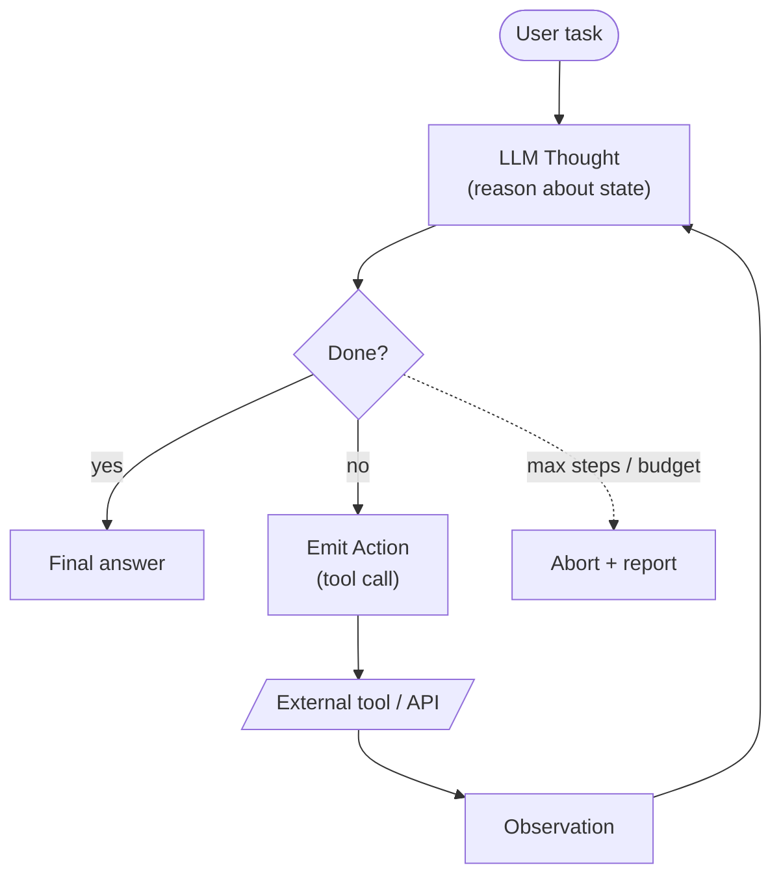

# AI Agents and Agentic Systems

[← Back to index](../../README.md) · [Cheat sheet](./cheatsheet.md)

> AI agents that plan, use tools, and reason in loops — architectures, memory, multi-agent systems, and failure modes.

### What is an AI agent, and how does it differ from a simple LLM call?

**TL;DR:** An agent is an LLM in a loop with tools, memory, and goals — not a single one-shot prompt-response call.

A simple LLM call takes input and produces output once with no ability to act on the world. An agent wraps the LLM in a control loop where it can plan, invoke tools, observe results, update state, and iterate until a goal is reached. This adds autonomy, persistence, and the capacity for multi-step reasoning over external systems. The tradeoff is higher cost, latency, and failure surface area compared to direct calls. Reference: [AI Engineering Explained: LLM, RAG, MCP, Agent, Fine-Tuning, Quantization](https://www.youtube.com/watch?v=lnfWvX66FUk) and [AI Agent Explained](https://outcomeschool.com/blog/ai-agent).

### AI Agent Memory

**TL;DR:** Mechanisms that let agents retain context across turns, sessions, or tasks — short-term, long-term, and episodic stores.

Agent memory generally splits into short-term (in-context working memory of the current task), long-term (persistent facts, preferences, learned skills stored in vector DBs or KV stores), and episodic (records of past interactions or trajectories). Memory is read on demand via retrieval and written via summarization or explicit save tools. Without memory, agents repeat work, lose user context, and cannot learn from prior outcomes. Memory design balances recall quality, token cost, and staleness. Reference: [AI Agent Memory](https://outcomeschool.com/blog/ai-agent-memory).

### Harness Engineering in AI

**TL;DR:** The discipline of building the scaffolding around an LLM — tools, loops, memory, prompts, eval — that turns a model into a reliable agent.

Harness engineering treats the model as one component in a larger system and focuses on the surrounding code that controls inputs, outputs, retries, observability, and tool wiring. Good harnesses make weak models perform well; bad harnesses waste strong models. Key concerns are prompt structure, context window management, tool schemas, error handling, and evaluation hooks. It is the engineering substrate beneath every production agent. Reference: [Harness Engineering in AI](https://outcomeschool.com/blog/harness-engineering-in-ai).

### Explain the ReAct (Reasoning + Acting) agent architecture.

**TL;DR:** ReAct interleaves Thought, Action, Observation steps so the LLM reasons aloud before each tool call and adapts based on results.

In ReAct the model emits a Thought (chain-of-thought reasoning), then an Action (a tool call with arguments), then receives an Observation (tool output), and repeats until it emits a final answer. This pattern grounds reasoning in real evidence and lets the agent recover from bad steps by re-thinking. It is simple to implement and works well for exploratory tasks like search and QA. Weaknesses include drift over long trajectories and high token cost from verbose thoughts. Reference: [ReAct Agent](https://outcomeschool.com/blog/react-agent). Reference: [ReAct: Synergizing Reasoning and Acting in Language Models (Yao et al., 2022)](https://arxiv.org/abs/2210.03629).

### What is the Plan-and-Execute agent pattern?

**TL;DR:** A planner LLM produces a multi-step plan upfront, then an executor carries out steps sequentially, optionally replanning on failure.

Plan-and-Execute separates strategic planning from tactical execution: a strong model decomposes the goal into steps, and a cheaper executor runs each step with tools. This reduces per-step token cost compared to ReAct and gives a clear structure for parallelization and progress tracking. It works well when the task decomposition is stable and steps are independent. The downside is rigidity — when reality diverges from the plan, the agent must replan, which adds complexity. Reference: [Plan-and-Execute Agent](https://outcomeschool.com/blog/plan-and-execute-agent).

### What is tool use (function calling) in LLMs, and how does it enable agents?

**TL;DR:** Tool use lets the LLM emit structured calls to external functions; the harness executes them and returns results, enabling action in the real world.

Function calling exposes a typed schema of available tools to the model, which then outputs a JSON call selecting a tool and its arguments. The harness invokes the function, returns the result, and feeds it back into the conversation. This bridge between language and code is what turns an LLM from a text generator into an agent that can query APIs, read files, run code, or modify state. Reliability depends on schema clarity, parameter validation, and good error feedback. Reference: [AI Engineering Explained: LLM, RAG, MCP, Agent, Fine-Tuning, Quantization](https://www.youtube.com/watch?v=lnfWvX66FUk).

### How do you design and define tools for an AI agent?

**TL;DR:** Small set of orthogonal tools, crisp names, typed parameters, descriptive docs, and explicit error semantics.

Each tool should do one thing with a clear name and a docstring that explains when to use it and when not to. Parameter schemas should use precise types and enums rather than free strings to reduce hallucination. Return structured, parseable outputs and surface errors as informative messages the model can act on. Limit the total number of tools to keep selection reliable, and group related operations into single tools with mode parameters when appropriate. Reference: [AI Engineering Explained: LLM, RAG, MCP, Agent, Fine-Tuning, Quantization](https://www.youtube.com/watch?v=lnfWvX66FUk).

### What is the difference between single-agent and multi-agent systems?

**TL;DR:** Single-agent has one LLM loop owning the task; multi-agent has multiple specialized agents collaborating, communicating, or competing.

Single-agent systems are simpler to debug, cheaper, and have unified context, but struggle when tasks require diverse expertise or parallelism. Multi-agent systems assign roles (planner, researcher, coder, critic) and coordinate via messages or shared memory, enabling specialization and parallel work. The cost is orchestration complexity, communication overhead, and harder failure analysis. Use multi-agent only when a single agent demonstrably cannot handle the workload. Reference: [Multi-Agent Systems](https://outcomeschool.com/blog/multi-agent-systems).

### What is Model Context Protocol (MCP), and how does it standardize tool integration?

**TL;DR:** MCP is an open protocol that lets LLM hosts connect to tool/data servers via a uniform interface, decoupling agents from tool implementations.

MCP defines how clients (agent hosts) discover and call resources, tools, and prompts exposed by servers. Instead of each agent reimplementing integrations, any MCP-compatible host can use any MCP server, similar to how LSP standardized editor-language integration. This enables a marketplace of reusable tool servers and reduces vendor lock-in. The protocol handles authentication, schema discovery, and streaming responses. Reference: [AI Engineering Explained: LLM, RAG, MCP, Agent, Fine-Tuning, Quantization](https://www.youtube.com/watch?v=lnfWvX66FUk). Reference: [Model Context Protocol specification](https://modelcontextprotocol.io).

### What are the different types of agent memory (short-term, long-term, episodic)?

**TL;DR:** Short-term = current context window; long-term = persistent facts/skills in external store; episodic = records of past task trajectories.

Short-term memory lives in the prompt and supports the current reasoning chain but is bounded by context length. Long-term memory persists across sessions in a vector DB or KV store and holds user preferences, learned facts, or domain knowledge, retrieved on demand. Episodic memory records sequences of past interactions or task executions, useful for few-shot learning from prior experience. A robust agent combines all three, with summarization moving items between tiers as relevance and recency change.

### How do you handle agent failures and implement error recovery?

**TL;DR:** Catch tool errors, surface them to the model with context, cap retries, validate outputs, and escalate to human or safe fallback.

Wrap every tool call in error handling that returns structured failure messages the agent can reason about rather than crashing. Limit retry counts per step and per task to avoid loops, and detect repeated identical failures as a signal to change strategy or stop. Validate model outputs against schemas before acting, and use a critic or self-reflection step on critical actions. For unrecoverable errors, fall back to human-in-the-loop or a safe default rather than guessing.

### What is an agent loop, and how does it decide when to stop?

**TL;DR:** The think-act-observe cycle; it stops on explicit done signal, max iterations, budget exhaustion, or unrecoverable error.

The agent loop repeatedly samples the model, dispatches any tool calls, feeds results back, and continues until a termination condition fires. Termination signals include the model emitting a final answer or stop tool, hitting a configured max-step count, exceeding a token or dollar budget, or detecting a loop via state hashing. Good stop conditions are essential — without them agents waste cost or run forever. Reference: [AI Agent Explained](https://outcomeschool.com/blog/ai-agent).

### How do you evaluate and test AI agents?

**TL;DR:** Combine task-level success metrics, trajectory inspection, unit tests on tools, regression suites, and LLM-as-judge for open-ended outputs.

Define a benchmark of representative tasks with deterministic success criteria where possible (e.g., correct API result, file produced, test passes). Track end-to-end success rate, step count, token cost, and latency per task. Inspect trajectories to find systematic failure modes — wrong tool, bad params, infinite loops. Use LLM-as-judge for subjective outputs but validate the judge against human ratings. Maintain a regression suite that runs on every prompt or harness change.

### What are the security risks of agentic systems, and how do you mitigate them?

**TL;DR:** Prompt injection, tool misuse, data exfiltration, irreversible actions; mitigate with sandboxing, allowlists, scoped credentials, and human approval.

Agents that read untrusted content can be hijacked via prompt injection to execute unintended tool calls. Mitigations include treating all retrieved content as untrusted, sandboxing code execution, using least-privilege credentials per tool, allowlisting destinations for network or file ops, and requiring human approval for irreversible or high-blast-radius actions. Log every tool call for audit, and isolate agent runs from production systems where possible.

### What is the difference between reactive and proactive agents?

**TL;DR:** Reactive agents respond to triggers; proactive agents monitor state and initiate actions toward goals on their own.

A reactive agent runs only when invoked and processes a single request per invocation, like a chatbot. A proactive agent maintains long-running goals, polls or subscribes to data sources, and initiates work — for example a monitoring agent that detects anomalies and files tickets without being asked. Proactive agents need stronger guardrails, budget controls, and observability because they can act unprompted. They also require explicit goal and priority management to avoid runaway behavior.

### How do you manage token consumption and cost in long-running agent workflows?

**TL;DR:** Summarize history, prune irrelevant context, route cheap steps to small models, cache prompts, cap loop iterations, and budget per task.

Long agent runs accumulate context that inflates every subsequent call. Mitigate by summarizing or evicting old turns, retrieving only relevant memory snippets, and using a sliding window. Route planning to a strong model and execution to a cheap one. Use prompt caching for stable system prompts and tool schemas. Enforce hard limits on iterations, total tokens, and dollar spend per task with circuit breakers.

### What is the human-in-the-loop pattern for agents, and when is it needed?

**TL;DR:** A human approves or corrects agent actions at chosen checkpoints; needed for high-risk, ambiguous, or irreversible operations.

Human-in-the-loop inserts approval gates before sensitive actions like sending emails, deleting data, or spending money. The agent pauses, presents its plan or proposed action, and waits for confirmation, edit, or rejection. It is essential when the cost of error is high, when domain expertise is required to validate, or when regulatory compliance demands oversight. Design the UX to give humans enough context to decide quickly without becoming a bottleneck.

### How do you implement guardrails for AI agents to prevent harmful actions?

**TL;DR:** Layer input filters, output validators, tool allowlists, action quotas, sandboxing, and approval gates around the agent loop.

Guardrails operate at multiple layers: input sanitization rejects malicious prompts; output validators check for policy violations or schema mismatches before acting; tool-level allowlists restrict which operations are callable in a given context; quotas cap actions per minute or per task; sandboxes isolate side effects; and approval gates require human sign-off on flagged actions. No single guardrail is sufficient — defense in depth is the goal. Log every guardrail decision for auditing and improvement.

### What is agent reflection, and how does it improve agent performance?

**TL;DR:** The agent critiques its own output or trajectory, identifies errors, and revises — improving accuracy at the cost of extra calls.

Reflection adds a self-critique step where the agent (or a separate critic model) reviews the proposed answer or executed steps against the goal and known failure modes. Detected issues trigger a retry with feedback. This pattern catches reasoning errors, missed requirements, and tool misuse that a single pass would ship. Tradeoffs are extra latency and tokens, so reflection is best applied selectively to high-value outputs or as a final verification step. Reference: [Reflexion: Language Agents with Verbal Reinforcement Learning (Shinn et al., 2023)](https://arxiv.org/abs/2303.11366).

### What is the difference between code-generating agents and tool-calling agents?

**TL;DR:** Tool-calling agents pick from a fixed tool set per step; code-gen agents write and execute arbitrary code, gaining flexibility and risk.

Tool-calling agents emit structured calls to predefined functions — safe, predictable, easy to audit, but limited to capabilities you exposed. Code-generating agents write Python or shell scripts that compose operations dynamically, enabling complex workflows in a single step and reducing round trips. Code-gen is more powerful and often more token-efficient, but requires sandboxed execution, output parsing, and careful error handling. Choose tool-calling for narrow domains and code-gen for open-ended computation.

### How do you handle multi-modal inputs and outputs in agentic systems?

**TL;DR:** Use models with native multi-modal support, normalize artifacts to typed references, and route per-modality processing through specialized tools.

Modern agents accept images, audio, PDFs, and more. Pass these to multi-modal LLMs directly when possible, or preprocess via OCR, ASR, or vision tools that emit text descriptions. Treat large artifacts as references (URIs or IDs) rather than inlining bytes into context. For outputs, route generation tasks to modality-specific models (image gen, TTS) invoked as tools. Maintain a consistent artifact store so agents can pass references between steps.

### How do you implement state management in complex agent workflows?

**TL;DR:** Externalize state in a structured store (DB, KV, graph), checkpoint between steps, and reference state by ID rather than dumping into context.

Stuffing all state into the prompt does not scale and is fragile. Instead persist task state, intermediate artifacts, and progress in an external store keyed by task ID, and pass only summaries or references into the model context. Checkpoint after each significant step so failed runs can resume rather than restart. Use frameworks like LangGraph or custom state machines to make transitions explicit and inspectable.

### How do you build a customer support agent with escalation logic?

**TL;DR:** Tiered tools for FAQ, account actions, and ticket creation; classifier routes intent; escalate to human on low confidence, sentiment, or policy triggers.

Start with a knowledge-base retrieval tool for FAQs, account-lookup and basic action tools for transactional requests, and a ticket-creation tool for the rest. Use intent classification to route requests and a confidence threshold to decide when to act vs. escalate. Escalate immediately on detected frustration, explicit human-request, or any high-risk action like refunds above a threshold. Log every interaction with handoff context so the human starts with full history.

### What is agent orchestration, and how do you implement it?

**TL;DR:** The layer that coordinates multiple agents or workflow steps — routing tasks, managing state, handling handoffs and failures.

Orchestration assigns work to the right agent or tool, manages shared state, sequences dependent steps, and handles retries and escalation. Implementations range from simple supervisor-agent patterns (one agent calls others as tools) to graph-based workflows (LangGraph, Temporal, custom DAGs) that model transitions explicitly. Key responsibilities include observability, timeout handling, parallelism, and a clear contract for inter-agent messages. Choose the simplest orchestration that meets reliability and concurrency needs.

### How do you build a code execution agent safely using sandboxed environments?

**TL;DR:** Run code in isolated containers or microVMs with no host network, scoped filesystem, resource limits, and a kill timeout.

Use Docker, gVisor, Firecracker, or hosted sandboxes (E2B, Modal, Daytona) to isolate execution from the host and other tasks. Mount only required input files read-only, cap CPU/memory/disk, disable or proxy network egress, and enforce wall-clock timeouts. Capture stdout, stderr, and produced artifacts as structured outputs the agent can reason about. Treat any code that touches external systems as needing extra approval or scoped credentials.

### Your AI agent is stuck in an infinite loop. How do you detect and break the cycle?

**TL;DR:** Add max-iteration cap, hash recent (action, args, observation) tuples to detect repetition, and force-exit with a summary on detection.

Infinite loops usually arise when the agent retries the same failing action or oscillates between two states. Detect by hashing recent trajectory tuples and breaking when the same hash repeats N times within a window. Always enforce a hard max-step and max-token cap as a backstop. On detection, exit the loop, log the trajectory for debugging, and either return a partial result, escalate to human, or trigger a replan with the loop pattern surfaced as feedback. Reference: [Fix an infinite loop in an AI agent](https://www.linkedin.com/posts/pallavi-shekhar_ai-aiagents-machinelearning-share-7440257380707364864-5Ycc).

### Your AI agent gets conflicting answers from different tools. How does it reconcile them?

**TL;DR:** Rank tools by trust, cross-check with a third source, prefer most recent or authoritative, and surface unresolved conflicts to the user.

Define a trust hierarchy among tools (e.g., system-of-record DB beats cached search). When answers disagree, the agent should consult an additional source or the canonical authority and prefer freshness and provenance. For factual queries, citation-based reconciliation works well — pick the source with the strongest evidence. If conflict cannot be resolved confidently, return both answers with their sources rather than fabricating consensus, and optionally escalate.

### Your AI agent burns too many tokens per task. How do you reduce token consumption?

**TL;DR:** Summarize history, retrieve instead of dumping, shrink tool schemas and prompts, route to smaller models, cache prompts, cap loop steps.

Profile where tokens go — system prompt, tool schemas, conversation history, tool outputs. Compress each: trim verbose system prompts, retrieve only relevant memory and docs, summarize old turns, and truncate large tool outputs to relevant slices. Use prompt caching for static prefixes. Route subtasks to smaller cheaper models when quality permits. Enforce per-task token budgets with hard stops. Reference: [How would you reduce the token consumption?](https://www.linkedin.com/posts/pallavi-shekhar_ai-aiagents-machinelearning-activity-7439550125015994368-LTmE).

### Your AI agent keeps exceeding its budget per task. How do you enforce budget limits?

**TL;DR:** Track tokens and dollars per task in a counter, check before each call, and abort or downgrade when thresholds are hit.

Wrap the model client in middleware that increments a per-task usage counter on every call and rejects further calls beyond a configured budget. On approach to the limit, take graceful action: switch to a cheaper model, summarize and prune context, skip optional reflection steps, or return a partial result with a budget-exceeded note. Surface budget telemetry per task to identify which workflows need redesign rather than just higher caps.

### Your AI agent hallucinates tool capabilities and passes wrong inputs. How do you fix it?

**TL;DR:** Sharper tool docs and parameter schemas, validation with informative errors, few-shot examples, and a critic step before execution.

Hallucinated tool use comes from vague names, missing or loose schemas, and lack of usage examples. Fix by writing crisp tool descriptions that say exactly when to use and when not to use the tool, switching string params to enums where possible, and adding example call patterns to the system prompt. Validate arguments before invocation and return structured error messages so the model can self-correct. For high-cost tools, add a verification step that checks the planned call against the goal.

### Your AI agent deleted a production database. How do you prevent irreversible actions?

**TL;DR:** Remove destructive tools from production scope, require human approval, use scoped read-only credentials by default, and rely on soft-delete with backups.

Irreversible actions should never be available to autonomous agents without explicit, per-action human approval. Remove or gate destructive tools (drop, delete, force-push, send-email) behind approval workflows. Run agents with least-privilege credentials — read-only by default, write only to scoped namespaces. Prefer soft-delete and reversible operations. Maintain backups and audit logs so any damage can be undone. Test agent permissions regularly with red-team exercises.

### Your AI agent has many tools, but keeps picking the wrong one. How do you improve tool selection?

**TL;DR:** Reduce tool count, sharpen names and descriptions, group similar tools, retrieve relevant tools per turn, and add few-shot selection examples.

Selection accuracy degrades sharply as tool count grows past 10–20. Audit and consolidate overlapping tools, write descriptions that emphasize differentiators, and rename tools to make their domain unambiguous. For large catalogs, do tool retrieval — embed tool descriptions and only present the top-k relevant tools per turn. Add few-shot examples in the system prompt showing correct selection on borderline cases. Track per-tool selection precision in evaluation.

### Your AI agent takes too long to complete a task. How do you speed it up?

**TL;DR:** Parallelize independent steps, cache, use smaller models for sub-steps, stream, prune context, and switch from ReAct to Plan-and-Execute when appropriate.

Profile end-to-end latency to find the bottleneck — usually serial LLM calls or slow tools. Parallelize independent tool calls and sub-agent runs. Cache tool results and prompt prefixes. Replace verbose ReAct loops with Plan-and-Execute when steps are knowable upfront. Route quick steps to faster smaller models. Stream responses to overlap generation with downstream consumption. Reduce context size — shorter prompts decode faster.

### Your LLM selects the right tool but extracts the wrong parameters. How do you fix parameter extraction?

**TL;DR:** Tighten schemas with types and enums, add parameter descriptions and examples, validate before calling, and feed validation errors back for retry.

Wrong parameters usually come from loose schemas (free strings instead of enums, no constraints) or under-described fields. Tighten the JSON schema with precise types, enums, regex patterns, and required fields. Add per-parameter descriptions and an example call in the tool docs. Validate arguments before invocation and return a structured error naming the bad field and expected format so the model can self-correct on retry. For complex inputs, ask the model to produce them in a separate dedicated step.

---

## Frontier (2025)

> _Frameworks, products, and benchmarks below are accurate as of 2026-05._

#### Coding agents

### What are coding agents (Claude Code, Cursor, Aider, Devin), and how do they differ architecturally?

**TL;DR:** LLM-driven agents that read, edit, run, and test code in a repo loop — they differ in autonomy level, UI surface, and harness design.

Cursor is an IDE-embedded copilot with tight inline editing, semantic codebase indexing, and a chat surface that shares the editor's context. Claude Code is a terminal-native agent (Anthropic) that operates on the working directory with shell, file, and edit tools, prioritizing transparent action and harness extensibility via subagents and hooks. Aider is an open-source CLI agent that uses git diffs as its action format and commits each change, optimizing for auditable edits on small to medium repos. Devin (Cognition) targets fully autonomous long-horizon software engineering with a managed VM, browser, and planner — higher autonomy, more failure surface. References: [Claude Code docs](https://docs.claude.com/en/docs/claude-code/overview), [Cursor docs](https://docs.cursor.com), [Aider repo](https://github.com/Aider-AI/aider).

### What is SWE-Bench, and why is it the leading benchmark for coding agents?

**TL;DR:** SWE-Bench evaluates agents on real GitHub issues from popular Python repos — solve = patch makes the project's hidden tests pass.

SWE-Bench (Jimenez et al., 2023) collected 2,294 issue-PR pairs from 12 mature Python projects; SWE-Bench Verified is a 500-task human-curated subset that fixes label noise. The agent receives a repo snapshot and an issue, produces a patch, and scores only if the project's withheld test suite passes. It is the leading benchmark because tasks are real, multi-file, require codebase navigation, and grading is objective. Frontier coding agents now report SWE-Bench Verified scores as a primary capability metric. Reference: [SWE-Bench paper](https://arxiv.org/abs/2310.06770), [SWE-Bench site](https://www.swebench.com).

### How do coding agents manage context across a large codebase?

**TL;DR:** Combine repo maps, semantic search, lazy file reads, and summarization — never load the whole repo into context.

Aider builds a "repo map" with tree-sitter that ranks files by graph centrality and includes only signatures for cold files. Cursor maintains a persistent embedding index over the workspace and retrieves relevant chunks per turn. Claude Code reads files on demand through grep/glob/read tools and lets the model decide what to load, often guided by a project-level CLAUDE.md. Strategies converge on lazy loading, retrieval, hierarchical summaries, and pinning a small set of high-signal files (entrypoints, types, configs) into the system prompt. The constant pressure is keeping working set small enough to reason but rich enough to avoid wrong-file edits.

### How do coding agents recover from failed builds, broken tests, or wrong file edits?

**TL;DR:** Run tests/build as observation, feed errors back into the loop, revert via git, and cap retries before escalating or replanning.

A robust coding agent treats the test suite and build as canonical observations: run after each edit, parse failures into structured feedback, and let the model propose a corrective patch. Use git as the undo layer — checkpoint before edits, revert on regression, and never accumulate broken state. Detect repeated failures via trajectory hashing and switch strategy (different file, ask user, decompose) instead of looping on the same error. Aider commits per change for clean rollback; Claude Code relies on the harness plus explicit revert tools. Reflection or a critic step on diffs catches semantic errors that pass syntactic checks.

### What is harness engineering for coding agents, and what design choices matter most?

**TL;DR:** Building the loop, tools, and observation layer around the model — choices in tool granularity, edit format, and feedback shape dominate quality.

For coding agents the harness decides: edit format (whole-file rewrite vs. unified diff vs. search-replace blocks), tool granularity (one mega-tool vs. read/grep/edit/run primitives), test/build integration, context strategy (eager index vs. lazy read), and recovery semantics (auto-revert, retries, branch isolation). Search-replace formats outperform whole-file rewrites on long files because they reduce token cost and drift; structured diff formats help with multi-file edits. Strong harnesses also enforce budgets, log trajectories, and expose hooks so users can inject project-specific tools. The model matters, but harness deltas often exceed model deltas on SWE-Bench. Reference: [Aider's edit format research](https://aider.chat/docs/leaderboards/edit_formats.html).

#### Agent frameworks

### Compare LangGraph, CrewAI, AutoGen, and OpenAI Swarm. When would you use each?

**TL;DR:** LangGraph = stateful graphs, CrewAI = role-based crews, AutoGen = conversational multi-agent, Swarm = minimal handoff primitives.

LangGraph (LangChain) models agents as explicit state machines / graphs with checkpointing, human-in-the-loop, and replay — pick it for production workflows needing durable state and observability. CrewAI focuses on declarative role/task/crew abstractions for multi-agent collaboration — pick for quick role-based prototypes. AutoGen (Microsoft) centers on conversational agents that exchange messages, with strong support for code-execution agents and group chat patterns — pick for research-style multi-agent dialogues. OpenAI Swarm (and its successor Agents SDK) is a minimal library focused on routines and handoffs between lightweight agents — pick when you want primitives without a heavy framework. References: [LangGraph](https://langchain-ai.github.io/langgraph/), [CrewAI](https://docs.crewai.com), [AutoGen](https://microsoft.github.io/autogen/), [OpenAI Agents SDK](https://github.com/openai/openai-agents-python).

### What is smolagents (HuggingFace), and what is the case for code-action agents?

**TL;DR:** smolagents is a tiny HF library where the agent writes Python code as its action, executed in a sandbox — code is more expressive than JSON tool calls.

smolagents (HuggingFace, 2024) ships a CodeAgent that emits Python snippets calling tools as functions, executed in a restricted Python interpreter or E2B sandbox. The case for code-action agents (per the CodeAct paper) is that a single Python step can compose loops, conditionals, and multiple tool calls — eliminating round trips that JSON tool-calling agents need for the same work. Empirically, code-action agents match or beat tool-calling agents on multi-step tasks with fewer LLM calls. Tradeoff is mandatory sandboxing and harder static analysis of intent. References: [smolagents](https://huggingface.co/docs/smolagents), [CodeAct paper](https://arxiv.org/abs/2402.01030).

### How do agent frameworks handle state, persistence, and replay?

**TL;DR:** Serialize state per step into a checkpointer (DB/KV); resume from any checkpoint; replay trajectories deterministically for debugging.

LangGraph defines a typed State schema and writes a checkpoint after every node via pluggable checkpointers (SQLite, Postgres, Redis), enabling resume, time-travel, and human-in-the-loop pauses. Temporal-style frameworks treat each step as a durable activity with deterministic replay from event history. AutoGen and CrewAI offer lighter persistence — primarily message logs — relying on the user for durable storage. Replay matters because non-deterministic LLM calls must be cached so re-running a trajectory does not regenerate divergent outputs. Production systems also externalize artifacts (files, embeddings) by reference so state stays small and serializable.

### When should you build your own agent framework vs use an existing one?

**TL;DR:** Use an existing framework for speed and standardization; build your own when integration, performance, or product-shape constraints make frameworks fight you.

Existing frameworks accelerate prototypes and standardize patterns (state, tools, tracing) but impose abstractions, version churn, and hidden prompt templates that complicate debugging. Build custom when you need tight control over the prompt, a non-standard control flow (e.g., streaming partial actions, custom recovery), strict latency or memory budgets, or deep coupling to a proprietary tool/runtime. A common path: prototype on LangGraph or Agents SDK to validate, then extract the loop into 200–500 lines of bespoke code once the design stabilizes. The harness is rarely the moat; predictability and observability are.

#### Browser & search tools

### How do agents use browser automation and search APIs (Tavily, Exa, Perplexity, headless browsers)?

**TL;DR:** Search APIs return ranked snippets cheaply; headless browsers (Playwright, browser-use) drive real pages when interaction or JS rendering is required.

Tavily and Exa expose LLM-tuned search APIs that return clean, ranked results with snippets — fast and token-cheap, ideal for research and RAG-style grounding. Perplexity's Sonar API bundles search with a synthesis step. For tasks requiring login, form fill, or interaction (booking, scraping JS-heavy sites), agents drive headless browsers via Playwright or higher-level wrappers like browser-use and Anthropic's Computer Use which let the model see screenshots and emit clicks/keystrokes. Tradeoff: search APIs are cheap and reliable but read-only; browser automation is powerful but slow, brittle, and needs strong guardrails against prompt injection from page content. References: [Tavily](https://tavily.com), [Exa](https://exa.ai), [browser-use](https://github.com/browser-use/browser-use).

#### Code-execution sandboxing

### Compare E2B, Modal, Fly Machines, Firecracker, and gVisor for sandboxing agent-generated code. How do you choose?

**TL;DR:** E2B = managed agent sandboxes, Modal = serverless compute, Fly Machines = microVMs as a service, Firecracker = the underlying microVM, gVisor = userspace kernel container isolation.

E2B is purpose-built for agent code execution: ephemeral cloud sandboxes with filesystem, network, and language runtimes, exposed via SDK — pick for prototypes and production agents needing a turnkey REPL. Modal provides serverless functions/containers with GPU support — pick for heavier compute, ML workloads, or when you already use it. Fly Machines spin up Firecracker microVMs on demand with full root and networking control — pick for custom runtime needs. Firecracker (AWS) is the microVM hypervisor itself (used by Lambda, Fargate, E2B); use directly only if running your own infra. gVisor (Google) is a userspace kernel that intercepts syscalls — strong container-level isolation but weaker than a real VM. Choose by required isolation level, latency to spin up, and ops appetite. References: [E2B](https://e2b.dev), [Firecracker](https://firecracker-microvm.github.io), [gVisor](https://gvisor.dev).

### How do you safely give an agent shell + filesystem access without risking the host?

**TL;DR:** Run the agent inside an isolated microVM or container, scope filesystem to a project dir, drop network egress, cap resources, and require approval for destructive ops.

Never give an agent a shell on the host. Run inside Firecracker/E2B/gVisor or at minimum a hardened Docker container with read-only root, a writable scratch volume, dropped capabilities (no CAP_SYS_ADMIN), seccomp profile, and no host network. Mount only the target project directory; mediate package installs through a proxy or pre-baked image. Disable or proxy network egress with an allowlist. Apply CPU, memory, PID, and wall-clock caps. Log every command, and require human approval for destructive verbs (rm -rf, force-push, sudo) or anything outside the project root. Treat any file read by the agent as potentially containing prompt injection that could attempt to escape — guardrail tool scopes accordingly.
