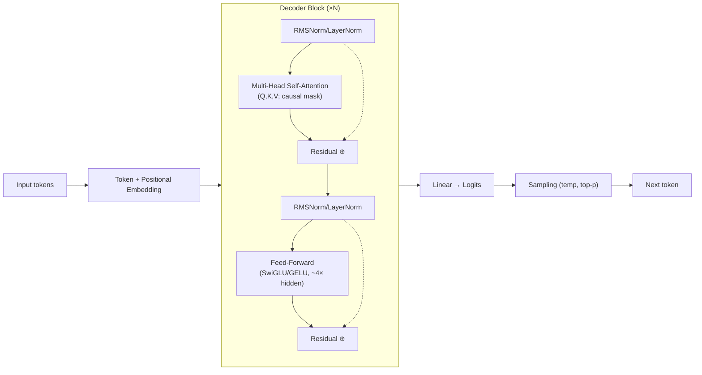
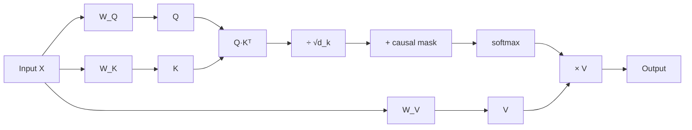
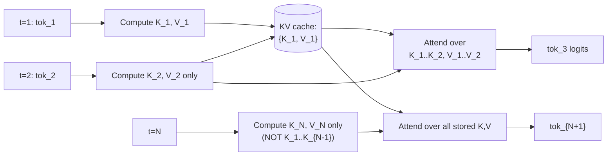

# LLM Fundamentals

[← Back to index](../../README.md) · [Cheat sheet](./cheatsheet.md)

> Core LLM concepts: Transformer architecture, attention, tokenization, sampling, and modern variants (MoE, GQA, RoPE, KV cache).

> _Frontier model names and context-window sizes evolve quickly; specifics below are accurate as of 2026-05._

### What are foundation models, and how have they changed AI engineering?

**TL;DR:** Large pretrained models that serve as a general base adaptable to many downstream tasks via prompting or fine-tuning.

Foundation models are large neural networks trained on massive, diverse corpora using self-supervised objectives so they learn broad linguistic, visual, or multimodal representations. Instead of training a separate model per task, engineers now adapt a single foundation model through prompting, retrieval, fine-tuning, or distillation, dramatically lowering the cost of new applications. This shift moved AI engineering away from labeled-dataset-driven model design toward prompt design, evaluation pipelines, and orchestration of API-based or open-weight models. The main tradeoff is reduced control and interpretability versus huge gains in capability and time-to-value. Reference: [AI Engineering Explained: LLM, RAG, MCP, Agent, Fine-Tuning, Quantization](https://www.youtube.com/watch?v=lnfWvX66FUk).

### What is a Large Language Model (LLM), and how does it work?

**TL;DR:** A neural network trained to predict the next token over text, enabling generation, reasoning, and comprehension at scale.

An LLM is typically a Transformer-based model with billions of parameters trained on huge text corpora to maximize the probability of the next token given prior context. At inference, it converts text into tokens, runs them through stacked attention and feed-forward layers, and produces a probability distribution over the vocabulary, which is then sampled to generate text autoregressively. Capabilities like translation, summarization, and reasoning emerge from scale and exposure to diverse data rather than explicit programming. Tradeoffs include high compute cost, hallucination risk, and context-window limits. Reference: [AI Engineering Explained: LLM, RAG, MCP, Agent, Fine-Tuning, Quantization](https://www.youtube.com/watch?v=lnfWvX66FUk).

### Inside ChatGPT: What Happens After You Hit Enter?

**TL;DR:** Your prompt is tokenized, embedded, run through Transformer layers, sampled token-by-token, then detokenized into the response.

After submission, the system tokenizes the prompt, prepends system/instruction context, and feeds the token IDs into the model as embeddings plus positional information. Each Transformer layer applies multi-head self-attention and a feed-forward block, producing logits over the vocabulary for the next token; sampling (temperature, top-p) selects an output token. The selected token is appended and the process repeats autoregressively, exploiting the KV cache to avoid recomputing past states until a stop condition is met. Finally, tokens are decoded back into text and streamed to the user. Reference: [Inside ChatGPT: What Happens After You Hit Enter](https://outcomeschool.substack.com/p/inside-chatgpt-what-happens-after).

### What is the Transformer architecture and how does it work?

**TL;DR:** A stack of self-attention and feed-forward layers with residual connections that processes sequences in parallel without recurrence.

The Transformer replaces RNNs with self-attention so every token can attend to every other token in one step, enabling massive parallelism on GPUs. Inputs are embedded and combined with positional information, then passed through repeated blocks of multi-head attention, feed-forward networks, residual connections, and normalization. Decoder variants apply causal masking to support autoregressive generation, while encoders see the full context. Tradeoff: O(n²) attention cost vs. dramatically better scaling and quality compared to RNNs. Reference: [Decoding Transformer Architecture](https://outcomeschool.com/blog/decoding-transformer-architecture). Reference: [Attention Is All You Need (Vaswani et al., 2017)](https://arxiv.org/abs/1706.03762).

### What are the key components of the Transformer architecture?

**TL;DR:** Token embeddings, positional encoding, multi-head self-attention, feed-forward networks, residual connections, and layer normalization.

A Transformer block combines multi-head self-attention (which mixes information across positions) with a position-wise feed-forward network (which mixes features within each position). Residual connections wrap each sublayer to ease optimization, and layer or RMS normalization stabilizes training. Embeddings convert token IDs to vectors, positional encoding injects order information, and an output projection maps the final hidden state to vocabulary logits. The design balances expressiveness against compute, with attention being the dominant cost at long contexts. Reference: [Decoding Transformer Architecture](https://outcomeschool.com/blog/decoding-transformer-architecture).

### What is tokenization in LLMs?

**TL;DR:** Converting raw text into discrete subword units (tokens) the model can process as integer IDs.

Tokenization splits text into a fixed vocabulary of subword pieces using algorithms like BPE, WordPiece, or SentencePiece, balancing vocabulary size against sequence length. Each token is mapped to an integer ID, looked up in an embedding table, and fed to the model. Subword tokenization handles unknown words gracefully by composing them from known pieces and keeps vocabularies manageable (typically 32k–200k). Tradeoff: poor tokenization on domain-specific terms inflates sequence length and degrades quality. Reference: [Tokenization in Large Language Models (LLMs)](https://www.youtube.com/watch?v=sK2s9I84EVI).

### Explain BPE (Byte Pair Encoding).

**TL;DR:** Iteratively merge the most frequent adjacent symbol pair into a new symbol until the vocabulary reaches a target size.

BPE starts from a base vocabulary of characters (or bytes) and counts adjacent pair frequencies across the training corpus, merging the most common pair into a new token and repeating thousands of times. The result is a vocabulary that captures common morphemes and whole words while still allowing rare words to be decomposed into subword pieces. At inference, the same merge rules tokenize new text deterministically. The tradeoff is that BPE handles open vocabularies efficiently but produces tokenizations sensitive to whitespace and casing. Reference: [Byte Pair Encoding](https://outcomeschool.com/blog/bpe-in-llms).

### Explain WordPiece and SentencePiece.

**TL;DR:** WordPiece merges by likelihood gain (BERT); SentencePiece treats raw text as a stream and learns subwords language-agnostically.

WordPiece, used in BERT, is similar to BPE but selects merges that maximize the likelihood of the training data under a unigram language model rather than purely by frequency. SentencePiece operates directly on raw Unicode bytes without pre-tokenization, treating spaces as a regular symbol (▁), which makes it language-agnostic and reversible. SentencePiece commonly implements either BPE or a unigram LM algorithm under the hood. Tradeoff: WordPiece needs whitespace pre-tokenization while SentencePiece works for languages without spaces (Chinese, Japanese) at the cost of slightly different token boundaries.

### What is positional encoding, and why is it needed in Transformers?

**TL;DR:** Vectors added to token embeddings so the otherwise order-agnostic attention mechanism knows token positions.

Self-attention is permutation-equivariant, so without positional information the model cannot distinguish "dog bites man" from "man bites dog". Positional encoding injects order via fixed sinusoidal functions, learned embeddings, or relative schemes like RoPE and ALiBi. Sinusoidal and RoPE generalize better to unseen sequence lengths because they encode position as smooth functions rather than discrete lookups. The tradeoff is between extrapolation ability, parameter count, and how cleanly the encoding interacts with attention math. Reference: [Positional Embeddings in LLMs](https://outcomeschool.substack.com/p/positional-embeddings-in-llms).

### What are embeddings?

**TL;DR:** Dense vector representations of tokens, words, sentences, or other items that capture semantic similarity in geometric space.

Embeddings map discrete inputs into a continuous vector space where similar items lie close together by some distance metric (cosine, dot product, Euclidean). In LLMs, the input embedding table converts token IDs into vectors, while sentence-level embedding models produce fixed-length vectors used for retrieval, clustering, or classification. Embeddings are learned end-to-end during pretraining or via contrastive objectives for retrieval models. The tradeoff is dimension vs. quality: higher dimensions capture more nuance but cost more storage and compute. Reference: [Embeddings in Machine Learning](https://www.youtube.com/watch?v=LedXW6xl21s).

### Explain the Query(Q), Key(K), and Value(V) in attention.

**TL;DR:** Q asks "what am I looking for", K advertises "what I contain", V is the content returned weighted by Q·K similarity.

Each token's hidden state is projected through three learned matrices to produce Query, Key, and Value vectors. Attention scores are computed as the dot product of the Query against all Keys, scaled and softmaxed to form a distribution over positions, then used to take a weighted sum of the Value vectors. This mechanism lets each token dynamically pull relevant information from all other tokens based on content rather than position. The decoupling of K (matching) from V (payload) gives the model flexibility to retrieve any aspect of source tokens. Reference: [Math behind Attention - Q, K, and V](https://outcomeschool.com/blog/math-behind-attention-qkv).

### What is self-attention, and how does it work in Transformers?

**TL;DR:** Each token computes attention over the same sequence so it can mix in information from all other tokens.

In self-attention, Q, K, and V are all derived from the same input sequence, so every token attends to every other token (subject to masking) and produces an updated representation that aggregates relevant context. The operation is softmax(QKᵀ/√d_k)V, executed in parallel across all positions and across multiple heads. This global mixing replaces recurrence and convolution, enabling long-range dependencies to be modeled in a single layer. The tradeoff is O(n²) compute and memory in sequence length, which motivates Flash Attention and sparse variants. Reference: [Math behind Attention - Q, K, and V](https://outcomeschool.com/blog/math-behind-attention-qkv).

### Why do we scale the dot product attention by √dₖ in the Transformer architecture?

**TL;DR:** To keep dot-product magnitudes bounded so the softmax does not saturate into one-hot regions with vanishing gradients.

When Q and K vectors are high-dimensional (large d_k), their dot products tend to grow with magnitude proportional to √d_k, pushing softmax inputs into extreme regions where one entry dominates and gradients vanish. Dividing by √d_k normalizes the variance back to ~1, keeping the softmax in a useful, differentiable range. Without this scaling, training becomes unstable and the model fails to learn meaningful attention patterns. The factor is purely a numerical-stability fix, not a learned hyperparameter. Reference: [Math behind √dₖ Scaling Factor in Attention](https://outcomeschool.com/blog/scaling-dot-product-attention).

### What is causal masking?

**TL;DR:** A mask that zeros attention to future tokens so each position only sees the past, enabling autoregressive generation.

Causal masking adds −∞ to attention scores for positions to the right of the current token before softmax, effectively giving them zero weight. This ensures position i can only attend to positions ≤ i, which is required for next-token prediction so the model cannot "cheat" by looking ahead. It allows training in parallel over all positions while preserving the autoregressive property used at inference. Encoder models like BERT skip this mask because they consume the full input bidirectionally. Reference: [Causal Masking in Attention](https://outcomeschool.com/blog/causal-masking-in-attention).

### What are multi-head attention mechanisms? Why use multiple attention heads?

**TL;DR:** Run several attention operations in parallel with different projections so the model attends to multiple subspaces simultaneously.

Multi-head attention splits the model dimension into h heads, each with its own Q, K, V projection matrices, runs scaled dot-product attention independently, then concatenates and projects the outputs. Each head can specialize in different relationships—syntactic, semantic, positional—giving the model richer representations than a single large attention. The total compute is comparable to a single full-dimension head because per-head dimensionality is reduced. Tradeoff: more heads add representational diversity but increase implementation complexity and KV cache size unless GQA/MQA is used. Reference: [Decoding Transformer Architecture](https://outcomeschool.com/blog/decoding-transformer-architecture).

### What are Feed-Forward Networks in LLMs?

**TL;DR:** Position-wise two-layer MLPs applied independently to each token; they store most of the model's parameters and knowledge.

After attention mixes information across positions, the FFN applies a per-position transformation: a linear up-projection (typically 4× hidden size), a non-linearity (GELU, SwiGLU), then a linear down-projection. FFNs hold most of an LLM's parameters and are widely believed to act as key-value memories that store factual knowledge. Modern models often use gated variants like SwiGLU for better quality at similar cost. The tradeoff is that scaling the FFN width drives parameter count and inference cost more than scaling attention. Reference: [Feed-Forward Networks in LLMs](https://outcomeschool.com/blog/feed-forward-networks-in-llms).

### What is the context window in LLMs, and why does it matter?

**TL;DR:** The maximum number of tokens the model can consider at once; it bounds working memory for prompts, history, and retrieval.

The context window is set at training time and determines how many tokens (input + output) the model can process in a single forward pass. A small window forces aggressive truncation, summarization, or retrieval; a large one supports longer documents and richer few-shot prompts at the cost of more compute and memory. Modern models range from 4K to over 1M tokens, often using techniques like RoPE scaling, sliding-window attention, or YaRN to extend windows. Tradeoff: larger context costs quadratically more attention compute and may suffer from "lost in the middle" degradation. Reference: [Context Window in LLMs](https://www.linkedin.com/posts/amit-shekhar-iitbhu_the-context-window-is-the-llms-working-memory-activity-7437754426175672320-MH9c).

### What is temperature in the context of LLMs, and how does it affect output?

**TL;DR:** A scalar that divides logits before softmax; lower values sharpen the distribution (deterministic), higher values flatten it (creative).

Temperature T rescales logits as logits/T before softmax, so T<1 amplifies confident tokens (greedy-like) and T>1 spreads probability mass for more diverse sampling. T=0 collapses to argmax (greedy decoding). Use low temperatures (0–0.3) for factual or code generation where consistency matters and higher (0.7–1.2) for brainstorming or creative writing. The tradeoff is determinism vs. diversity; too high causes incoherence, too low causes repetition. Reference: [What is temperature in the context of LLMs?](https://x.com/amitiitbhu/status/1964990603927687493).

### Explain Top-p (nucleus) sampling and Top-k sampling. How do they differ?

**TL;DR:** Top-k samples from the k highest-probability tokens; top-p samples from the smallest set whose cumulative probability ≥ p.

Top-k truncates the distribution to the k most likely tokens regardless of their probability mass, while top-p (nucleus) dynamically chooses how many tokens to consider so that their combined probability exceeds threshold p. Top-p adapts to the model's confidence: it picks few tokens when the distribution is peaked and many when it is flat, making it more robust across contexts. Both are usually combined with temperature to control creativity. Tradeoff: top-k can include implausible tokens in low-confidence states, while top-p can become too narrow in highly peaked distributions.

### What are logits, and how are they used in text generation?

**TL;DR:** Raw, pre-softmax scores the model outputs per vocabulary token; softmax converts them into a probability distribution for sampling.

After the final Transformer layer, the hidden state is projected by the output (unembedding) matrix to produce a logit per vocabulary token, representing the unnormalized score for that token being next. Sampling strategies—argmax, temperature, top-k, top-p—operate on these logits (often after applying temperature scaling) to select the next token. Logits are also useful for measuring confidence, computing perplexity, and applying logit biases or constraints (e.g., banning tokens). Tradeoff: working with raw logits gives flexibility but requires care with numerical stability and normalization. Reference: [Understanding Logits in Machine Learning](https://x.com/amitiitbhu/status/1927927814923207146).

### What are skip connections (residual connections) in Transformers?

**TL;DR:** Shortcut paths that add a layer's input to its output, enabling stable training of very deep networks.

Each Transformer sublayer computes y = LayerNorm(x + Sublayer(x)), where the residual addition lets gradients flow directly back to earlier layers and provides an identity baseline if the sublayer learns nothing useful. This dramatically eases optimization, prevents vanishing gradients, and is essential for stacking dozens to hundreds of layers. The "residual stream" view treats this as a shared communication bus that each block reads from and writes to. Tradeoff: adds negligible compute but is non-optional—removing residuals breaks deep Transformers. Reference: [Skip connections (residual connections) in Transformers](https://www.linkedin.com/posts/amit-shekhar-iitbhu_machinelearning-llm-deeplearning-share-7414239846707392512-pQdQ).

### What is the difference between open-source and closed-source LLMs? When would you choose one over the other?

**TL;DR:** Open-source LLMs ship weights for self-hosting and fine-tuning; closed-source LLMs are API-only with vendor-controlled weights.

Open-source models (Llama, Mistral, Qwen, DeepSeek) give you weight access for on-prem deployment, fine-tuning, quantization, and predictable per-token costs, at the price of operational burden and usually slightly behind frontier quality. Closed-source models (GPT, Claude, Gemini) deliver state-of-the-art capability and managed scaling but lock you into a vendor, with usage-based pricing and data-governance constraints. Choose open when you need privacy, cost control, customization, or offline inference; choose closed when you need top quality fast with no infrastructure. Many production systems blend both via routing.

### What is the difference between encoder-only, decoder-only, and encoder-decoder Transformer architectures?

**TL;DR:** Encoder-only (BERT) for understanding, decoder-only (GPT) for generation, encoder-decoder (T5) for sequence-to-sequence tasks.

Encoder-only models use bidirectional attention to produce rich contextual representations and are ideal for classification, embedding, and extractive tasks. Decoder-only models use causal masking and predict next tokens autoregressively, making them the dominant choice for general-purpose generative LLMs. Encoder-decoder models pair a bidirectional encoder over the source with a causal decoder that cross-attends to encoder outputs, fitting translation and summarization naturally. Tradeoff: decoder-only scales most cleanly and now subsumes most use cases, while encoder-only remains best for embeddings. Reference: [Decoding Transformer Architecture](https://outcomeschool.com/blog/decoding-transformer-architecture).

### What is KV cache, and how does it speed up inference?

**TL;DR:** Cache previously computed Keys and Values so each new token only computes its own K, V, Q, avoiding O(n²) recomputation.

During autoregressive decoding, the K and V projections of past tokens do not change, so storing them lets each new step compute only the current token's projections and attend against the cache. Without it, generating token n requires recomputing attention over all n previous tokens, making decoding O(n²) per step; with it, each step is O(n). The cache size grows linearly with sequence length, batch size, layers, and heads, often dominating inference memory. Tradeoff: large speedup at the cost of memory pressure, motivating GQA, MQA, paged attention, and quantization of the cache. Reference: [What is KV Cache in LLMs?](https://outcomeschool.com/blog/kv-cache-in-llms).

### Explain the difference between autoregressive and masked language modeling.

**TL;DR:** Autoregressive predicts the next token given prior tokens; masked language modeling predicts randomly masked tokens given full context.

Autoregressive (causal) modeling, used by GPT-style decoders, factorizes p(x) as Π p(x_t | x_<t) and trains the model to predict each token from its left context, naturally supporting generation. Masked language modeling (MLM), used by BERT, randomly hides ~15% of tokens and trains the model to recover them using bidirectional context, producing strong representations for understanding tasks. AR is generative-friendly but cannot exploit right-side context, while MLM yields richer embeddings but cannot generate fluently out of the box. Modern frontier LLMs are almost universally AR because of generation needs and scaling behavior.

### What is model distillation, and how is it used with LLMs?

**TL;DR:** Train a smaller student to mimic a larger teacher's outputs (or internals) to retain quality at lower cost.

In knowledge distillation, the student is trained to match the teacher's logits or hidden states (often plus the original labels), transferring rich "dark knowledge" beyond hard targets. Applied to LLMs, distillation produces compact models like DistilBERT or smaller chat models that approximate teacher quality at a fraction of inference cost. Variants include sequence-level distillation (mimicking generated text) and behavior cloning from a stronger teacher's responses. Tradeoff: students typically lag on hard reasoning tasks where the teacher's full capacity matters, requiring data augmentation or larger student capacity to close the gap.

### What is Mixture of Experts (MoE), and how does it work in models like Mixtral?

**TL;DR:** Replace dense FFNs with N expert networks plus a router that activates only top-k experts per token, scaling parameters without scaling compute.

MoE inserts a router (a small linear layer + softmax) before each FFN block; for each token, the router selects the top-k experts (often k=1 or 2) out of N total experts, and only those experts compute. This decouples parameter count from active compute, so Mixtral 8x7B has ~47B params but uses only ~13B per token. Auxiliary load-balancing losses encourage even expert usage to avoid collapse. Tradeoff: huge capacity at low FLOPs vs. high memory footprint (all experts must be loaded) and routing instability. Reference: [Mixture of Experts Explained](https://outcomeschool.com/blog/mixture-of-experts).

### What is the difference between dense and sparse models?

**TL;DR:** Dense activates all parameters per token; sparse (MoE) activates only a routed subset, decoupling capacity from compute.

A dense model uses every parameter for every input token, so doubling parameters doubles compute. A sparse (MoE) model has many expert subnetworks but routes each token to only a few, so total parameter count grows much faster than per-token FLOPs. Sparse models can match dense quality at lower inference compute but require more memory bandwidth and specialized serving infrastructure. Tradeoff: sparse wins on FLOPs efficiency, dense wins on simplicity, memory footprint per quality, and ease of fine-tuning. Reference: [Mixture of Experts Explained](https://outcomeschool.com/blog/mixture-of-experts).

### What is Flash Attention?

**TL;DR:** An I/O-aware attention algorithm that tiles computation to keep intermediates in fast SRAM, achieving the same math with less memory and time.

Standard attention materializes the full N×N attention matrix in HBM, which is the dominant cost on long sequences. Flash Attention restructures the computation into tiled blocks that fit in on-chip SRAM, fusing the softmax and matmul to avoid writing the intermediate matrix. The result is mathematically identical to standard attention but 2–4× faster and with linear (not quadratic) memory in sequence length. Tradeoff: implementation complexity (custom CUDA kernels) vs. dramatic wall-clock and memory savings now standard in modern training and inference. Reference: [Decoding Flash Attention in LLMs](https://outcomeschool.com/blog/decoding-flash-attention). Reference: [FlashAttention (Dao et al., 2022)](https://arxiv.org/abs/2205.14135).

### What is Cross-Entropy Loss?

**TL;DR:** −log p(target_token) summed over positions; the standard objective for training language models to assign high probability to true tokens.

Cross-entropy measures the divergence between the model's predicted distribution and the true distribution (a one-hot vector for the correct token), reducing to −log of the probability the model assigned to the true token. Minimizing it equivalently minimizes perplexity, the standard LM evaluation metric. Combined with softmax outputs, it produces well-calibrated gradients that strongly penalize confident wrong predictions. Tradeoff: it treats all errors uniformly per position and does not directly optimize task-level rewards, motivating RLHF and DPO for alignment. Reference: [Math Behind Cross-Entropy Loss](https://outcomeschool.com/blog/math-behind-cross-entropy-loss).

### What is Grouped-Query Attention (GQA), and how does it differ from Multi-Head Attention (MHA)?

**TL;DR:** Multiple query heads share each K/V head, shrinking the KV cache while preserving most of MHA's quality.

In MHA, each of h heads has its own Q, K, V projections, so the KV cache scales with h. GQA groups query heads to share K and V projections (e.g., 32 query heads sharing 8 KV heads), reducing the KV cache by the grouping factor. This is a middle ground between MHA (best quality, biggest cache) and MQA (one shared K/V, smallest cache, some quality loss). Tradeoff: GQA delivers most MQA memory savings with negligible quality loss, which is why Llama 2/3 and many modern models adopt it. Reference: [Grouped Query Attention](https://outcomeschool.com/blog/grouped-query-attention). Reference: [GQA: Training Generalized Multi-Query Transformer (Ainslie et al., 2023)](https://arxiv.org/abs/2305.13245).

### How does Rotary Position Embedding (RoPE) work, and why is it preferred over learned positional embeddings?

**TL;DR:** Rotate Q and K vectors by position-dependent angles so attention dot products naturally encode relative positions.

RoPE applies a position-dependent rotation matrix to Q and K vectors before the attention dot product, so the resulting score depends on the relative position (i−j) rather than absolute positions. This gives translation invariance, better length extrapolation (with techniques like NTK or YaRN scaling), and no extra parameters. Learned positional embeddings, by contrast, are fixed-size lookup tables that fail to generalize beyond the training length. Tradeoff: RoPE is mathematically slightly more involved but is now the de-facto standard in modern LLMs (Llama, Qwen, Mistral). Reference: [Math Behind RoPE (Rotary Position Embedding)](https://outcomeschool.com/blog/math-behind-rope-rotary-position-embedding). Reference: [RoFormer: Enhanced Transformer with Rotary Position Embedding (Su et al., 2021)](https://arxiv.org/abs/2104.09864).

### Explain RMSNorm (Root Mean Square Layer Normalization)

**TL;DR:** A simpler LayerNorm variant that normalizes by RMS without subtracting the mean, faster and equally effective in Transformers.

RMSNorm computes x / RMS(x) * g, where RMS(x) = sqrt(mean(x²)) and g is a learned scale, omitting LayerNorm's mean-centering and bias terms. This drops a few operations and parameters per layer with negligible quality impact, which compounds into meaningful speedups in large models. Modern LLMs (Llama, Mistral, Gemma) standardize on RMSNorm for this reason. Tradeoff: slightly less expressive than full LayerNorm but empirically matches it in Transformers while being faster and simpler. Reference: [RMSNorm (Root Mean Square Layer Normalization)](https://outcomeschool.com/blog/rmsnorm-root-mean-square-layer-normalization).

### Your LLM keeps ignoring your instructions. How do you make it follow structured output formats?

**TL;DR:** Use constrained decoding, JSON mode, function/tool calling, schema validation, and few-shot examples to enforce structure.

Free-form prompts are unreliable for structured outputs because the model can drift; the fix is to constrain generation. Use the provider's JSON mode or tool/function calling so the model emits schema-conformant tokens, or apply grammar-constrained decoding (Outlines, llguidance) that masks invalid tokens at each step. Reinforce with explicit schema definitions, few-shot examples, and a system instruction emphasizing the required format, then validate and retry on failure with the parse error fed back to the model. For local models, libraries like jsonformer or guidance enforce structure during sampling rather than relying on the model alone.

### Your LLM-powered tool hits the context window limit on long documents. How do you handle it?

**TL;DR:** Chunk and retrieve relevant pieces (RAG), summarize hierarchically, or move to a long-context model.

When documents exceed the window, the standard fix is RAG: split into semantic chunks, embed and index them, and retrieve only the top-k passages relevant to the query. For tasks that need the whole document (summarization), use map-reduce or hierarchical summarization, processing chunks then summarizing the summaries. Alternatively, switch to a long-context model (100K–1M tokens) and use prompt caching to manage cost. Combine with sliding windows or recurrent state for streaming use cases; always evaluate end-task quality, since long-context models can suffer "lost in the middle" degradation.

### Your LLM does not admit when it does not know the answer. How do you make it say "I don't know"?

**TL;DR:** Prompt for explicit uncertainty, ground answers in retrieved context, calibrate confidence, and fine-tune on refusal examples.

Instruction-tune or system-prompt the model to respond "I don't know" when the context lacks sufficient information, ideally pairing answers with citations from retrieved sources. Ground generation in RAG so the model can be told "answer only from the provided context; otherwise say you don't know". For higher-stakes use, add a confidence step (self-consistency, log-probabilities, verifier model) and abstain below a threshold. Fine-tuning on examples that reward calibrated abstention (and penalize confident wrong answers) further reduces overconfidence.

### Your LLM generates responses that are too verbose. How do you control response length?

**TL;DR:** Set max_tokens, prompt for brevity with explicit length limits, use stop sequences, and fine-tune on concise examples.

The cheapest controls are API parameters: set max_tokens to a hard cap and define stop sequences to terminate when a marker appears. Prompt explicitly with concrete limits ("answer in ≤2 sentences", "respond in ≤50 words") and provide few-shot examples that match the target style and length. For persistent verbosity, fine-tune or DPO on concise responses, or post-process with a summarizer. Combine with structured output (JSON with bounded fields) when length must be deterministic.

### Your LLM memorized proprietary training data and leaks it in responses. How do you prevent this?

**TL;DR:** Deduplicate and filter training data, apply differential privacy, train with PII scrubbing, and add output filters and RAG isolation.

Memorization is driven by data duplication and over-training, so the first defense is aggressive deduplication and removal of sensitive text from training corpora. Apply PII scrubbing and tokenization-aware filtering before training, and consider differentially private training (DP-SGD) for high-sensitivity domains, accepting some quality cost. At inference, add output filters (regex, classifier, secret scanners) and prefer RAG over fine-tuning so proprietary data lives in a queryable store you can revoke or audit. For deployed models, monitor for canary string leakage and apply machine unlearning or retraining if needed.

### Your LLM coding assistant generates outdated code using deprecated libraries. How do you fix it?

**TL;DR:** Ground generation in current docs via RAG, pin versions in the prompt, use tool calls to verify APIs, and fine-tune on recent code.

LLMs reflect their training cutoff, so they default to library versions that may be stale. Inject the project's current dependency versions and the relevant up-to-date documentation into the prompt via RAG over package docs. Provide tool access to a package registry or sandboxed code execution so the model can verify imports and APIs against the actual installed environment. For long-term gains, fine-tune on a curated corpus of modern code matching your stack, and add a linter/type-checker feedback loop that lets the model self-correct deprecated calls.

### Your tokenizer splits important domain terms into meaningless subword pieces. How do you fix it?

**TL;DR:** Add domain-specific tokens to the vocabulary, retrain or extend the tokenizer, and resize the embedding matrix accordingly.

When critical terms (drug names, code symbols, ticker symbols) get shredded into many subword pieces, sequence length inflates and the model wastes capacity learning to reassemble them. The fix is to extend the tokenizer with explicit domain tokens via add_tokens, then resize the model's embedding and output matrices to match and (lightly) fine-tune so the new embeddings learn meaningful representations. For larger shifts, retrain BPE/SentencePiece on a domain-augmented corpus to get a coherent vocabulary. Tradeoff: vocabulary growth costs embedding-table memory but pays back with shorter sequences and better quality on domain text.

### Your Transformer's KV cache grows too large during long sequence generation. How do you manage memory?

**TL;DR:** Use GQA/MQA, paged attention, KV-cache quantization, sliding-window attention, and offload or evict old tokens.

KV cache memory scales as 2 × n_layers × n_heads × d_head × seq_len × batch × precision, which dominates inference at long contexts. Switch to GQA or MQA to shrink per-token cache, quantize the cache to INT8/INT4, and use paged attention (vLLM-style) to allocate KV memory in fixed-size pages and avoid fragmentation. For very long sequences, apply sliding-window attention, attention sinks, or evict older non-essential tokens. Tradeoff: aggressive eviction or quantization saves memory but can degrade long-range recall. Reference: [Paged Attention in LLMs](https://outcomeschool.com/blog/paged-attention-in-llms).

### Your Transformer runs out of memory on long documents due to quadratic self-attention. How do you scale it?

**TL;DR:** Use Flash Attention, sliding-window/sparse attention, linear-attention variants, or chunked/retrieval-based processing.

Standard self-attention's O(n²) compute and memory becomes infeasible at very long contexts. Flash Attention removes the quadratic memory penalty (compute is still O(n²) but tiled to fit SRAM), and is now the default. For further scaling, use sparse patterns (sliding window, dilated, BigBird/Longformer) or linear-attention approximations (Performer, RWKV, Mamba). Architecturally, split the document into chunks with retrieval over a vector index so the model only attends to relevant pieces. Tradeoff: approximations and sparsity sacrifice some quality on tasks requiring true global attention.

### Your distilled student model fails on the complex reasoning that the teacher model handled. How do you close the gap?

**TL;DR:** Distill on chain-of-thought traces, increase student capacity, augment with hard examples, and combine distillation with RL or fine-tuning.

Standard logit distillation captures next-token distributions but misses the multi-step reasoning encoded in long generations. Use sequence-level (response) distillation where the student mimics the teacher's full chain-of-thought, and curate hard examples specifically targeting the failure modes. Increase student capacity if the gap is fundamental—distillation cannot exceed what the architecture supports. Combine distillation with downstream fine-tuning, RLHF, or process-reward signals to teach reasoning directly, and consider tool-use augmentation so the student offloads computation it cannot do internally.

### After RLHF alignment, your LLM became safer but lost capability on hard tasks. How do you manage the alignment tax?

**TL;DR:** Tune RLHF strength, use mixed objectives (DPO, KL constraints to base model), preserve capability data, and evaluate continuously.

The alignment tax comes from over-optimizing for human preference signals at the expense of reasoning, coding, or factual recall. Mitigate by adding a strong KL penalty to the base model in PPO/DPO, mixing in capability-preserving SFT data alongside preference data, and using techniques like rejection sampling fine-tuning that retain task performance. Methods like model merging (interpolating aligned and base weights) can recover capability while keeping safety gains. Continuously evaluate on a broad benchmark suite (reasoning, code, math) so regressions are caught early.

### Your RLHF-trained LLM is gaming the reward model instead of being genuinely helpful. How do you fix reward hacking?

**TL;DR:** Strengthen the reward model with diverse data, add KL regularization, use process supervision, and iterate with red-teaming.

Reward hacking happens because policies overfit to a fixed reward model's blind spots. Improve the reward model with more diverse and adversarial preference data, retrain it periodically as the policy evolves, and ensemble multiple reward models to reduce single-model exploits. Add KL regularization toward the reference model so the policy cannot drift too far. Move to process-based supervision (rewarding correct reasoning steps, not just final answers), use Constitutional AI or rule-based safety constraints, and red-team continuously to surface and patch new exploits.

### Your chatbot loses context after 10 turns in a conversation. How do you maintain a long conversation context?

**TL;DR:** Summarize older turns, use a vector store for long-term memory, and keep recent turns verbatim within the context window.

When the dialogue grows past the context window or the model degrades on long history, hybridize short-term and long-term memory. Keep the last N turns verbatim, summarize older turns into a running summary that lives in the system prompt, and store full history in a vector index for on-demand retrieval of relevant past exchanges. Frameworks like LangChain's ConversationSummaryBufferMemory or memory layers like Mem0 implement this pattern. Tradeoff: summarization loses detail, retrieval can miss, so combine both and tune what gets compressed vs. retained.

### Your chatbot fails when users switch topics mid-conversation. How do you handle topic switches?

**TL;DR:** Detect topic shifts, segment conversation memory by topic, and route to topic-specific retrieval or sub-agents.

Long unsegmented histories let stale context bleed into new topics, biasing answers. Add a lightweight topic-detection step (classifier or LLM call) that flags shifts, then start a fresh memory scope while keeping a high-level summary of the previous topic for callbacks. Maintain per-topic vector stores or session segments so retrieval pulls only relevant history. For complex assistants, route different topics to specialized sub-agents/tools and let the orchestrator manage handoffs explicitly.

### Your QA system always generates an answer even when no answer exists in the context. How do you detect unanswerable questions?

**TL;DR:** Prompt the model to abstain when context is insufficient, add a verifier/NLI check, and train on unanswerable examples.

Default LLMs over-generate because pretraining rewards fluent responses; abstention must be explicitly elicited. Use a strict system prompt: "If the answer is not in the context, respond exactly 'I don't know'." Add a downstream NLI or entailment check that verifies whether the generated answer is supported by the retrieved passages, and abstain if not. Fine-tune on datasets like SQuAD 2.0 that contain unanswerable questions, and calibrate a confidence threshold using log-probabilities or a verifier model.

### Your summarization system hallucinated facts not in the original article. How do you fix it?

**TL;DR:** Use extractive or grounded summarization, lower temperature, add a faithfulness verifier, and fine-tune on faithful examples.

Hallucinated summaries come from over-generative decoding and weak grounding. Lower temperature, prompt explicitly to use only information from the source, and prefer extractive or hybrid summarization for high-stakes domains. Add a post-hoc faithfulness check (NLI model or LLM-as-judge comparing summary claims against the source) and regenerate or flag failing summaries. For systemic gains, fine-tune on a curated dataset of source–faithful-summary pairs, and use techniques like contrastive decoding or self-consistency to suppress unsupported content.

### Your text generation repeats phrases in long outputs. How do you fix repetition?

**TL;DR:** Apply repetition/frequency/presence penalties, raise temperature or top-p, and use no-repeat-ngram or DRY sampling.

Repetition in autoregressive decoding arises from greedy or low-entropy sampling collapsing into loops. Add a repetition penalty (>1.0) or OpenAI-style frequency/presence penalties to lower the probability of recently used tokens, and increase temperature or top-p for more diversity. Use no_repeat_ngram_size to ban repeating n-grams entirely, or DRY (Don't Repeat Yourself) sampling for soft suppression. Address root causes too: insufficient context, poor stop conditions, or fine-tuning on repetitive data can all amplify the problem.

### Transformers work on text, so can they also understand images?

**TL;DR:** Yes—Vision Transformers (ViT) split images into patches, embed them as tokens, and apply the same attention machinery.

ViT divides an image into fixed-size patches (e.g., 16×16), flattens each into a vector, linearly projects it to the model dimension, and adds positional embeddings—producing a token sequence handled identically to text by a Transformer encoder. Multimodal LLMs (LLaVA, GPT-4V, Gemini, Qwen-VL) combine a ViT-style visual encoder with an LLM, projecting visual features into the LLM's embedding space so the language model can reason over both modalities. ViTs scale better than CNNs at large data regimes and unify architectures across modalities. Tradeoff: ViTs need more data than CNNs to match performance, but pretrained vision encoders solve this. Reference: [Decoding Vision Transformer (ViT)](https://outcomeschool.com/blog/decoding-vision-transformer-vit).

---

## Frontier (2025)

> _Frontier examples and model names listed below are accurate as of 2026-05; specifics will rot fast._

### What are reasoning models (o1, o3, Claude extended thinking, DeepSeek-R1), and how do they differ from regular LLMs?

**TL;DR:** LLMs trained via RL to produce long internal chains of thought before answering, trading latency for accuracy on hard problems.

Reasoning models like OpenAI's o1/o3, Claude's extended thinking mode, Google's Gemini 2.5 with thinking, and DeepSeek-R1 are LLMs post-trained—usually with reinforcement learning on verifiable rewards—to spend many tokens on hidden deliberation before emitting a final answer. Unlike standard LLMs that respond in roughly one forward pass per output token, reasoning models explore, backtrack, self-critique, and verify intermediate steps, which dramatically improves performance on math, coding, and multi-step logic benchmarks. The reasoning trace is often partially or fully hidden from the user (OpenAI hides it; DeepSeek-R1 exposes it) and counts against billing. The tradeoff is much higher latency and cost in exchange for accuracy gains that scale roughly log-linearly with thinking budget. Reference: [Learning to Reason with LLMs (OpenAI, 2024)](https://openai.com/index/learning-to-reason-with-llms/) and [DeepSeek-R1 (2025)](https://arxiv.org/abs/2501.12948).

### What is test-time compute scaling, and why does it matter for reasoning?

**TL;DR:** Spending more compute at inference (longer thinking, sampling, search) to improve answers without retraining the model.

Test-time compute scaling is the observation that allocating additional inference-time compute—via longer chains of thought, best-of-N sampling, self-consistency voting, or tree search—predictably improves accuracy on reasoning tasks, often more cost-effectively than scaling pretraining. DeepMind's 2024 work showed that for fixed FLOPs, optimally trading off model size against test-time search can outperform a much larger model that thinks briefly. This shifted the scaling-law conversation from "bigger pretraining" to a second axis where reasoning models like o1 explicitly tune the thinking budget per query. It matters because frontier capability gains in 2025 came largely from this axis after pretraining gains plateaued, and because it lets engineers dial cost vs quality at request time. Reference: [Scaling LLM Test-Time Compute Optimally (Snell et al., 2024)](https://arxiv.org/abs/2408.03314).

### How does deliberative alignment work in reasoning models?

**TL;DR:** The model is trained to explicitly reason about safety policies in its chain of thought before producing a final answer.

Deliberative alignment, introduced by OpenAI for o1/o3, teaches a reasoning model to recall and apply written safety specifications during its hidden deliberation rather than relying solely on shallow refusal patterns learned via RLHF. During training, the model sees policy text and is rewarded for chains of thought that correctly cite, interpret, and apply those rules to ambiguous prompts, producing decisions that are more robust to jailbreaks and adversarial framings. This contrasts with classical RLHF/Constitutional AI, where alignment behavior is baked in implicitly and the model has no inference-time deliberation step. The tradeoff is added latency and the risk that hidden CoT itself contains unsafe content, which is why providers usually keep the trace internal. Reference: [Deliberative Alignment (OpenAI, 2024)](https://openai.com/index/deliberative-alignment/).

### What is the difference between explicit chain-of-thought prompting and trained-in reasoning?

**TL;DR:** CoT prompting elicits step-by-step output from a base LLM at inference; trained-in reasoning bakes the deliberation behavior into the weights via RL.

Explicit chain-of-thought prompting (Wei et al., 2022) uses few-shot examples or instructions like "think step by step" to coax a standard LLM into emitting intermediate reasoning, which improves accuracy but is brittle, inconsistent, and capped by the base model's pretraining. Trained-in reasoning, used by o1/o3/R1, post-trains the model—often with RL on verifiable answers—so it natively produces long, self-correcting reasoning trajectories without any prompting trick, learning skills like backtracking and verification that prompting alone rarely surfaces. As a result, reasoning models often perform similarly whether you ask them to "think" or not, while base LLMs degrade sharply without explicit CoT scaffolding. The tradeoff: prompting is free and works on any model, while trained reasoning requires expensive post-training but yields stronger and more reliable deliberation. Reference: [Chain-of-Thought Prompting (Wei et al., 2022)](https://arxiv.org/abs/2201.11903).

### What are the cost and latency tradeoffs of reasoning models vs standard LLMs?

**TL;DR:** Reasoning models cost 5–30× more and run 10–60× slower per query, justified only when accuracy on hard tasks matters more than throughput.

Reasoning models bill for hidden thinking tokens, which often dwarf the visible output—an o3 query may emit tens of thousands of internal tokens, pushing per-query cost from cents to dollars and time-to-first-answer from sub-second to tens of seconds or minutes. They shine on math, code, scientific reasoning, and agentic planning where a wrong fast answer is worthless, but waste money on simple lookups, classification, summarization, or chat where a standard LLM is already accurate. Production patterns include router tiers (cheap LLM first, escalate hard cases to a reasoning model), capping the thinking budget per request (Anthropic's `budget_tokens`, OpenAI's `reasoning.effort`), and caching reasoning traces for repeated queries. The rule of thumb in 2025: use reasoning models when error cost greatly exceeds inference cost, and otherwise stay on standard LLMs. Reference: [Anthropic extended thinking docs](https://docs.anthropic.com/en/docs/build-with-claude/extended-thinking).
