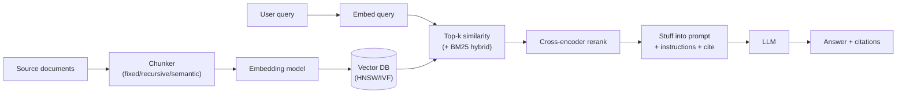

# Retrieval-Augmented Generation (RAG)

[← Back to index](../../README.md) · [Cheat sheet](./cheatsheet.md)

> Retrieval-Augmented Generation: grounding LLM answers in external knowledge via chunking, embedding, search, and re-ranking.

### What is Retrieval-Augmented Generation (RAG), and why is it important?

**TL;DR:** RAG augments LLM prompts with retrieved external documents, grounding answers in fresh, domain-specific knowledge.

RAG combines a retriever (vector or hybrid search over a knowledge base) with a generator (LLM) so the model conditions its answer on retrieved passages rather than relying solely on parametric memory. It matters because LLMs have stale training data, hallucinate facts, and cannot easily learn private corpora; retrieval supplies up-to-date, attributable context without retraining. RAG is cheaper than fine-tuning for knowledge updates and supports citations for trust. It is the dominant pattern for enterprise question answering, search assistants, and chatbots over proprietary data. Reference: [AI Engineering Explained: LLM, RAG, MCP, Agent, Fine-Tuning, Quantization](https://www.youtube.com/watch?v=lnfWvX66FUk). Reference: [Retrieval-Augmented Generation for Knowledge-Intensive NLP Tasks (Lewis et al., 2020)](https://arxiv.org/abs/2005.11401).

### Explain the architecture of a basic RAG system.

**TL;DR:** Ingest, chunk, embed, store, retrieve top-k, then prompt the LLM with question plus retrieved context.

Offline: documents are loaded, split into chunks, embedded with a text encoder, and stored in a vector database alongside metadata. Online: the user query is embedded, the top-k nearest chunks are retrieved (often re-ranked), and concatenated with the query into a prompt template for the LLM. The LLM generates an answer grounded in the supplied context, optionally returning citations to the source chunks. Optional layers include query rewriting, hybrid search, and post-generation verification. Reference: [AI Engineering Explained: LLM, RAG, MCP, Agent, Fine-Tuning, Quantization](https://www.youtube.com/watch?v=lnfWvX66FUk).

### What are the key components of a RAG pipeline?

**TL;DR:** Loader, chunker, embedder, vector store, retriever, re-ranker, prompt template, LLM generator, and evaluator.

A RAG pipeline starts with document loaders and parsers (PDF, HTML, Office), feeds a chunker that splits text into retrievable units, and an embedding model that maps chunks to vectors stored in a vector DB with metadata. At query time a retriever performs vector or hybrid search, an optional cross-encoder re-ranker reorders results, and a prompt template injects passages into the LLM call. Auxiliary components include query transformers (HyDE, decomposition), citation builders, caches, and offline evaluators (faithfulness, recall). Observability and feedback loops close the loop for iterative tuning. Reference: [AI Engineering Explained: LLM, RAG, MCP, Agent, Fine-Tuning, Quantization](https://www.youtube.com/watch?v=lnfWvX66FUk).

### What are chunking strategies, and how do you choose the right chunk size?

**TL;DR:** Split documents into retrievable units; pick size by content density, embedding context, and answer granularity.

Chunking strategies include fixed-size (token or character windows with overlap), recursive splitting on natural separators (paragraphs, sentences), semantic chunking based on embedding similarity, and structural chunking using headings or layout. Choose chunk size to balance recall (smaller, more focused) versus context completeness (larger, more self-contained); typical sizes are 256–1024 tokens with 10–20% overlap. Match the chunker to the embedding model's max context and to the question type—short factoids favor smaller chunks while reasoning over procedures favors larger ones. Always evaluate empirically on a labeled retrieval set.

### Compare fixed-size chunking, semantic chunking, and recursive chunking.

**TL;DR:** Fixed is fast/naive; recursive respects structure; semantic groups by meaning but is costliest.

Fixed-size chunking slices text every N tokens with overlap; it is simple and uniform but can break sentences and dilute embeddings. Recursive chunking splits on a hierarchy of separators (paragraphs, then sentences, then tokens) until a target size is reached, preserving syntactic units. Semantic chunking embeds candidate sentences and merges adjacent ones whose similarity exceeds a threshold, producing topically coherent chunks at the cost of extra compute. In practice teams start with recursive splitting and graduate to semantic chunking when retrieval quality plateaus.

### What are embedding models, and how do they convert text to vectors?

**TL;DR:** Neural encoders that map text to fixed-dimension vectors where semantic similarity corresponds to cosine proximity.

Embedding models are typically transformer encoders trained with contrastive objectives so semantically related sentences land near each other in vector space. Input text is tokenized, passed through the encoder, and pooled (CLS, mean, or last-token) into a single dense vector of 384–4096 dimensions. Training uses pairs or triplets from query/document, NLI, or synthetic LLM-generated data with hard-negative mining. The resulting vectors enable approximate nearest-neighbor search to retrieve semantically similar passages even when wording differs.

### How do you choose an embedding model for your RAG system?

**TL;DR:** Pick by domain, language, dimension, max context, license, and MTEB-style benchmark scores on your data.

Start from leaderboards (MTEB, BEIR) but always re-benchmark on a held-out set drawn from your corpus and queries. Consider dimension (storage and latency), max sequence length (must fit your chunks), multilingual support, and whether the model handles your domain (code, biomedical, legal). Decide between hosted APIs (OpenAI, Voyage, Cohere) for quality and managed scaling versus open-source models (BGE, E5, Nomic) for cost, on-prem, and fine-tuning. Re-evaluate when models update; switching often requires re-embedding the entire corpus.

### Explain Agentic RAG.

**TL;DR:** RAG where an LLM agent plans, decides when/what to retrieve, calls tools iteratively, and self-corrects.

Agentic RAG replaces the static retrieve-then-generate flow with an LLM agent that reasons over the query, chooses among multiple tools (vector search, SQL, web, calculators), and iterates until it has enough evidence. It can decompose multi-hop questions, route to specialized indices, re-query when results are weak, and verify answers before responding. This adds latency and cost but handles complex, ambiguous, or multi-source questions far better than single-shot RAG. Frameworks like LangGraph and LlamaIndex provide orchestration primitives for these loops. Reference: [Agentic RAG](https://outcomeschool.com/blog/agentic-rag).

### What is hybrid search, and why is it better than pure vector search?

**TL;DR:** Combines lexical (BM25) and dense vector retrieval; captures both keyword precision and semantic recall.

Pure vector search excels at paraphrase and semantic match but can miss exact terms, codes, names, or rare jargon that BM25 retrieves easily. Hybrid search runs both retrievers in parallel and fuses their rankings, typically via Reciprocal Rank Fusion (RRF) or weighted score normalization. The result is more robust across query types—keyword-heavy lookups and conceptual questions alike—and is widely adopted in production search stacks. The downside is added complexity and the need to tune fusion weights.

### What is re-ranking, and how does it improve RAG retrieval quality?

**TL;DR:** A second-stage cross-encoder reorders top candidates using full query-document attention for higher precision.

First-stage retrieval (bi-encoder or BM25) is fast but uses independent embeddings, missing fine-grained query-document interactions. A re-ranker—typically a cross-encoder like BGE-reranker or Cohere Rerank—takes the top 20–100 candidates and scores each (query, passage) pair jointly with full attention, dramatically improving precision@k. Cost grows linearly with candidates so re-rank only the shortlist, not the whole index. Re-ranking is one of the highest-ROI upgrades in a RAG pipeline.

### How do you handle multi-document and multi-hop questions in RAG?

**TL;DR:** Decompose query into sub-questions, retrieve per hop, aggregate evidence, and let an agent or graph reason.

Multi-hop questions require chaining facts across documents, which a single retrieval rarely satisfies. Techniques include query decomposition (LLM rewrites the question into sub-queries), iterative retrieval (retrieve, read, re-query), and graph-based approaches like GraphRAG that traverse entity relations. Aggregation can be done by concatenating evidence into one prompt or by an agent that reasons step by step, citing each hop. Evaluation should explicitly include multi-hop datasets (HotpotQA-style) so regressions are caught.

### What is the "lost in the middle" problem in RAG systems?

**TL;DR:** LLMs attend best to start and end of context; relevant info in the middle is often ignored.

Empirical studies show transformer LLMs exhibit a U-shaped attention pattern: passages near the prompt's beginning or end are recalled accurately while those in the middle are frequently overlooked, even within the model's context window. Mitigations include keeping context small, re-ranking so the most relevant chunk is placed first or last, summarizing or compressing middle passages, and avoiding cramming top-k=50 into a single prompt. Smaller, well-ordered context typically beats larger unordered context.

### How do you evaluate a RAG system? Explain faithfulness, relevance, and context precision/recall.

**TL;DR:** Measure retrieval (precision/recall) and generation (faithfulness, answer relevance) with labeled or LLM-judged sets.

Retrieval metrics include context precision (fraction of retrieved chunks that are relevant) and context recall (fraction of needed evidence retrieved), computed against gold passages. Generation metrics include faithfulness (answer claims supported by retrieved context, no hallucination) and answer relevance (response addresses the question). Frameworks like RAGAS, TruLens, and DeepEval automate these via LLM-as-judge or NLI models. Build a versioned eval set early; component-level metrics let you isolate whether failures originate in retrieval or generation.

### Explain Self-RAG. How does the model decide when to retrieve?

**TL;DR:** Model emits special reflection tokens to decide retrieval, grade evidence, and self-critique its answer.

Self-RAG fine-tunes an LLM to generate control tokens like `[Retrieve]`, `[IsRel]`, `[IsSup]`, and `[IsUse]` interleaved with normal generation. The model first decides whether retrieval is necessary; if so, it fetches passages, grades each for relevance and support, then produces an answer with self-evaluation tokens. At inference, beam search over these tokens lets the system trade off cost and quality, skipping retrieval for simple questions and verifying support for factual claims. This makes RAG adaptive rather than always-on. Reference: [Self-RAG: Learning to Retrieve, Generate, and Critique (Asai et al., 2023)](https://arxiv.org/abs/2310.11511).

### What is GraphRAG, and when would you use it over traditional RAG?

**TL;DR:** Builds a knowledge graph from documents; use it for global, multi-hop, or relational queries over a corpus.

GraphRAG (popularized by Microsoft) extracts entities and relations from documents into a graph, clusters nodes into communities, and pre-computes community summaries. Queries can traverse the graph or aggregate community summaries to answer broad "what are the main themes" questions that vector RAG handles poorly. Use GraphRAG when questions require connecting many documents, reasoning over relationships, or summarizing large corpora; stay with vector RAG for direct factual lookup where graph construction cost is unjustified. Reference: [GraphRAG](https://outcomeschool.com/blog/graphrag). Reference: [From Local to Global: A Graph RAG Approach (Edge et al., 2024)](https://arxiv.org/abs/2404.16130).

### How do you handle structured data (tables, SQL databases) in a RAG pipeline?

**TL;DR:** Use text-to-SQL or table-aware retrievers; do not naively embed rows as flat text.

For SQL databases, route the query to a text-to-SQL agent that generates and executes a query, then feeds results back to the LLM; pure embedding of rows loses schema semantics. For tables embedded in documents, parse them into Markdown or structured JSON, optionally serialize per row with column headers, and store with rich metadata. Hybrid pipelines route the query: classify whether it needs structured lookup, unstructured retrieval, or both, then merge results. Tools like LlamaIndex, Vanna, and DSPy provide table and SQL routing primitives.

### What are the common failure modes of RAG systems, and how do you debug them?

**TL;DR:** Bad chunking, weak embeddings, missing context, hallucination, stale data; debug per stage with eval metrics.

Typical failures: retriever returns irrelevant chunks (poor chunking, wrong embedding model), retrieves relevant chunks but generator ignores them (prompt issue, lost-in-the-middle), generator fabricates beyond context (faithfulness failure), or knowledge is missing entirely (ingestion gap). Debug by tracing each stage: log retrieved chunks with scores, compare to gold passages, check faithfulness against retrieved context, and inspect prompts. Component-level evals (context recall, faithfulness) localize the bug; logs and tools like LangSmith or Arize expose per-query traces.

### How do you handle document updates and maintain freshness in a RAG system?

**TL;DR:** Track document versions and timestamps; incrementally re-embed changed chunks; expire stale entries.

Maintain content hashes or modification timestamps per document so the ingestion pipeline can detect adds, updates, and deletes. On change, re-chunk and re-embed only affected documents, upserting new vectors and removing old ones from the index. For high-velocity sources, use streaming ingestion (Kafka, change-data-capture) and TTL or recency boosts at query time. Periodic full re-index runs catch drift in chunkers or embedding model upgrades.

### How do you optimize RAG for latency in production?

**TL;DR:** Cache, shrink top-k, use smaller embeddings/LLMs, parallelize retrieve+rerank, stream tokens.

Latency budgets split across embedding the query, vector search, optional re-ranking, prompt assembly, and LLM generation. Optimize each: cache query embeddings and frequent answers, reduce top-k after re-ranking, choose ANN indexes (HNSW, IVF) tuned for recall/latency, use smaller dimensions or quantization, run retrieval and reranker in parallel where possible. For generation, prefer smaller or distilled models, stream tokens, and pre-warm KV caches. Measure P95/P99 not just averages.

### What is the role of metadata filtering in RAG systems?

**TL;DR:** Pre- or post-filters on metadata (tenant, date, type) narrow search to relevant subset, boosting precision.

Metadata such as document source, author, date, language, security class, or product line is stored alongside vectors and used as filters during search. This restricts retrieval to a permissible or relevant subset—e.g., only this user's tenant, only docs newer than 2024, only API reference pages—improving precision and enforcing access control. Most vector DBs support pre-filtering (more accurate) or post-filtering (faster but may return fewer than k results). Schema design and indexing of metadata fields are essential at scale.

### Compare RAG vs fine-tuning. When would you use each?

**TL;DR:** RAG injects knowledge; fine-tuning teaches behavior or style. Use RAG for facts, fine-tuning for skills.

RAG is the right tool when the gap is knowledge—up-to-date facts, proprietary documents, large reference corpora—because it avoids retraining and supports citations. Fine-tuning is appropriate when the gap is behavior—tone, format, domain reasoning, structured output, or compressing long instructions into the model. The two are complementary: fine-tune the model for task style and use RAG to supply current facts. Cost, latency, and update cadence usually tip the scale toward RAG first. Reference: [AI Engineering Explained: LLM, RAG, MCP, Agent, Fine-Tuning, Quantization](https://www.youtube.com/watch?v=lnfWvX66FUk).

### What is query transformation in RAG (HyDE, query decomposition, step-back prompting)?

**TL;DR:** LLM rewrites the query (hypothetical doc, sub-questions, abstraction) before retrieval to improve recall.

Raw user queries are often short, ambiguous, or mismatched with document phrasing. HyDE asks the LLM to generate a hypothetical answer/document to the query and embeds that, since synthetic answers often align better with target passages. Query decomposition splits compound questions into sub-queries, each retrieved separately. Step-back prompting generates a more general question to retrieve broader context first, then answers the specific question. Each adds an LLM call but typically lifts retrieval recall significantly. Reference: [HyDE: Precise Zero-Shot Dense Retrieval without Relevance Labels (Gao et al., 2022)](https://arxiv.org/abs/2212.10496).

### How do you implement citation and source attribution in RAG?

**TL;DR:** Tag each chunk with a stable ID; instruct the LLM to cite IDs; post-verify citations against retrieved context.

Assign every chunk a stable identifier and metadata (URL, title, page) at ingestion. Inject chunks into the prompt with their IDs and instruct the model to attach `[id]` markers to each claim, optionally using structured output (JSON with answer plus citations). Post-process by mapping IDs back to source URLs and verify cited spans actually appear in retrieved context to catch fabricated citations. For higher rigor, use NLI or LLM-judges to confirm each sentence is supported by its cited chunk.

### How do you scale a RAG system to millions of documents?

**TL;DR:** Use ANN indexes (HNSW/IVF), shard by tenant or topic, quantize vectors, separate hot/cold tiers.

At scale, exact search is infeasible; use approximate nearest neighbor structures like HNSW, IVF-PQ, or DiskANN tuned for recall vs latency. Shard the index by tenant, topic, or hash to keep per-shard size manageable and parallelize search. Apply scalar or product quantization to shrink memory footprint, and tier storage so hot vectors stay in RAM while cold ones live on SSD. Add metadata pre-filters, distributed re-ranking, and caching layers; managed vector DBs (Pinecone, Weaviate, Qdrant, Vespa) handle much of this.

### What is parent-child chunking, and how does it improve retrieval?

**TL;DR:** Embed small child chunks for precise matching, return larger parent chunks for richer context.

Small chunks embed with sharper semantic focus and improve retrieval precision, but they often lack enough context for the LLM to answer well. Parent-child (also called small-to-big) chunking embeds fine-grained children (e.g., sentences) for search, then expands matches up to their parent chunk (paragraph or section) before feeding to the LLM. This decouples the retrieval granularity from the generation granularity, getting the best of both. LlamaIndex calls this the auto-merging or hierarchical retriever.

### Your RAG system is hallucinating despite having the right context. How do you fix it?

**TL;DR:** Tighten prompt to forbid outside knowledge, add citation requirement, lower temperature, use a faithfulness check.

First confirm the gold context is actually in the prompt and not lost in the middle—reorder so it sits at start or end. Strengthen the system prompt to instruct the model to answer only from provided context and to say "I don't know" otherwise. Lower temperature, require structured output with citations, and add a post-generation faithfulness verifier (NLI or LLM-judge) that re-checks each claim against the context, retrying or refusing on failure. Consider a stronger generator model if hallucination persists.

### Your RAG chunk overlap causes redundant results. How do you reduce redundancy?

**TL;DR:** Apply MMR or near-duplicate filtering on results; reduce overlap; deduplicate by content hash.

Overlap is necessary to avoid breaking ideas across boundaries but yields near-duplicate retrievals. Apply Maximal Marginal Relevance (MMR) at retrieval time to balance relevance and diversity, picking each next chunk to be relevant yet dissimilar from already-selected ones. Alternatively, post-filter with cosine-similarity thresholds or content hashes to drop duplicates. Tune chunk size and overlap so semantic units don't fragment, and consider parent-child retrieval so neighboring children collapse into one parent.

### Your RAG retrieval is too slow with a large knowledge base. How do you speed it up?

**TL;DR:** Switch to ANN index, quantize vectors, shard, cache, and reduce top-k plus reranker candidates.

Profile to find the bottleneck—embedding the query, ANN search, re-ranking, or LLM. For search, move from flat to HNSW or IVF-PQ, tune `efSearch` or `nprobe` for the recall/latency tradeoff, and apply scalar or product quantization to shrink vectors. Pre-filter by metadata so search runs on a smaller subset, shard across nodes, and cache frequent queries. For re-ranking, drop fewer candidates into the cross-encoder or use a smaller reranker.

### Your RAG system returns duplicate results. How do you deduplicate?

**TL;DR:** Hash chunks at ingestion; apply MMR or similarity threshold filters at retrieval; merge near-duplicates.

At ingestion, compute a content hash (or MinHash/SimHash for near-duplicates) and skip or merge identical chunks. At query time, post-process the retrieved list by dropping chunks whose pairwise cosine similarity exceeds a threshold, or apply MMR to enforce diversity. For source-level duplicates (same doc indexed twice), enforce uniqueness on a (source, version) key. Track deduplication metrics over time so silent regressions in ingestion get noticed.

### Your RAG system needs per-user access control on internal documents. How do you implement it?

**TL;DR:** Tag every chunk with ACL metadata; pre-filter retrieval by user identity; never bypass at LLM stage.

Store access control attributes (user IDs, group IDs, roles, tenant) as metadata on each vector, propagated from the source document's permissions. At query time, fetch the requesting user's identity and groups and apply a pre-filter so the vector DB only searches chunks the user is allowed to see. Never rely on the LLM to enforce permissions—filtering must happen in retrieval. Audit access decisions, sync ACLs on source permission changes, and isolate tenants by namespace or index where regulation demands.

### Your RAG system fails on domain-specific jargon. How do you fix it?

**TL;DR:** Fine-tune embeddings, add hybrid (BM25) search, build a glossary, expand queries with synonyms.

Generic embedding models often confuse or ignore specialized terms (drug names, ticker symbols, internal acronyms). Add BM25 to the retriever via hybrid search to catch exact-token matches, and fine-tune the embedding model on in-domain (query, passage) pairs—even a few thousand contrast pairs help. Maintain a glossary used to expand queries with synonyms or full forms of acronyms before retrieval. For high-stakes domains, evaluate domain-specialized encoders (BioBERT, FinBERT, Voyage-domain models).

### Your text-only RAG system now needs to handle images and tables. How do you extend it?

**TL;DR:** Use multimodal embeddings or extract text/captions; route by modality; serialize tables structurally.

For images, either generate captions via a vision-language model (BLIP, GPT-4V) and embed those alongside the image, or use multimodal embeddings (CLIP, Nomic-vision, Cohere multimodal) so images and queries share an index. For tables, parse into Markdown or JSON with column headers, then embed each row or the whole table with context; for big tables route to a SQL or DataFrame agent. A modality classifier on the query routes to the right retriever, and a multimodal LLM generates the final answer.

### Your RAG knowledge base gets updated frequently and needs versioning. How do you manage it?

**TL;DR:** Version documents and embeddings; keep snapshots; support point-in-time queries; re-index incrementally.

Treat the corpus like code: every document and chunk carries a version (git-like SHA or monotonic version) and an effective date range. Ingestion writes new versions without deleting old ones so historical queries can pin to a snapshot, and retrieval applies a "valid at time T" filter when needed. Maintain a schema/embedding-model version on the index so model upgrades trigger controlled re-embedding. Audit logs record what version answered each query for reproducibility.

### Your RAG system fails on multi-hop questions that require combining multiple facts. How do you fix it?

**TL;DR:** Decompose query into sub-questions, iterate retrieval, or use GraphRAG / agentic loops to chain evidence.

Single-shot retrieval rarely surfaces all facts needed for a multi-hop answer. Use an LLM to decompose the query into sub-questions, retrieve and answer each, then synthesize a final answer from the intermediate results. Alternatively use iterative or agentic RAG where the model retrieves, reasons, and re-queries until it can answer. For relational corpora, GraphRAG traversal across entity links handles multi-hop natively. Always evaluate against multi-hop benchmarks so regressions surface quickly.

### Your enterprise RAG system returns contradictory answers from different source documents. How do you resolve conflicts?

**TL;DR:** Rank sources by trust/recency, surface conflicts to the user, and let the LLM cite both with caveats.

Conflicts arise because corpora contain outdated, draft, or differing-perspective documents. Annotate each source with trust level, authority, and effective date, then weight retrieval and re-ranking by these signals so canonical sources dominate. Instruct the LLM to detect and report conflicts—citing both sides with timestamps—rather than silently picking one. For governed domains, route conflicting answers to human review and feed the resolution back into source curation.

### Your RAG system returns outdated answers from an evolving knowledge base. How do you keep it current?

**TL;DR:** Stream ingestion on changes, expire stale chunks, boost recency at retrieval, schedule periodic re-index.

Add change-data-capture or webhooks from source systems so updates flow into the ingestion pipeline within minutes; chunks carry timestamps and TTLs. Boost recent documents at retrieval time (recency-weighted score) for time-sensitive queries, and expire chunks past their valid date. Run periodic full re-ingestion to catch missed deletes and to re-embed when the model is upgraded. Monitor query-time freshness metrics and sample answers to catch drift before users do.

### Your RAG system struggles with PDF documents containing tables and layouts. How do you fix PDF parsing?

**TL;DR:** Use layout-aware parsers (Unstructured, LlamaParse, Docling) or vision models; preserve tables as Markdown.

Naive PDF text extraction (pdfminer, PyPDF2) loses reading order, merges columns, and shreds tables. Use layout-aware tools like Unstructured, LlamaParse, Docling, Azure Document Intelligence, or AWS Textract that detect blocks, columns, headings, and tables. Convert tables to Markdown or JSON with headers preserved, keep figure captions linked to images, and chunk by the recovered structural hierarchy. For complex scanned PDFs, fall back to a vision-language model that reads the page directly.

---

## Frontier (2025)

> _Frameworks and benchmarks below are accurate as of 2026-05._

### How do you use RAGAS, TruLens, and Phoenix to evaluate a RAG system end-to-end?

**TL;DR:** Combine RAGAS metrics, TruLens RAG triad, and Phoenix tracing for offline, online, and trace-level eval.

Stand up an offline eval set of (query, ground-truth answer, ground-truth contexts) and run RAGAS to score context precision/recall, faithfulness, and answer relevance—the canonical retrieval-vs-generation split. Layer TruLens on top for the "RAG triad" (context relevance, groundedness, answer relevance) computed as feedback functions on live or replayed traffic, which catches regressions RAGAS misses on real distributions. Use Arize Phoenix (or LangSmith) for OpenTelemetry-style tracing so every retrieve/rerank/generate span is captured, clustered by failure mode, and linkable to the failing eval row. Wire all three into CI: RAGAS gates merges, TruLens runs on a sampled production stream, Phoenix is the debugger when scores drop. Treat eval set curation as a first-class artifact—stale eval is worse than no eval.

### When should you use long-context windows instead of RAG, and when do you combine them?

**TL;DR:** Long context for small/cohesive corpora and reasoning; RAG for scale, freshness, citations, cost; combine for both.

Frontier models (Gemini 2.5, Claude 4.x, GPT-5) now offer 1M-2M token windows, and "Long-Context vs RAG" benchmarks (e.g., LOFT, RULER) show long context wins on small, cohesive corpora and reasoning that needs every fact simultaneously. RAG still dominates when the corpus is larger than the window, when freshness/ACLs/citations matter, or when per-query cost and latency are constrained—stuffing 1M tokens per call is expensive and triggers lost-in-the-middle even on strong models. The pragmatic 2025 pattern is hybrid: retrieve a generous top-k (50-200 chunks) and pass the full retrieved set into a long-context model, skipping aggressive re-ranking and trusting the model to attend. Use prompt caching to amortize the long shared prefix across queries, and fall back to tight RAG when latency or token budgets bite.

### How does cache-aware RAG work, and how do you structure retrieved context to maximize prompt-cache hits?

**TL;DR:** Put stable content first, retrieved chunks in a stable order, query last; cache the long prefix across calls.

Anthropic, OpenAI, and Google all expose prompt caching that charges ~10% of input tokens for cache hits, so RAG latency and cost collapse if you keep the prefix byte-identical across calls. Structure the prompt as: system instructions, tools, few-shot examples, then a slowly-changing "knowledge pack" of retrieved chunks, with the user query appended last—everything before the query becomes a cache hit. For per-query retrieval, pre-cluster the corpus into hot "context packs" (e.g., per-tenant or per-topic) and route queries to the pack so many users share the same cached prefix; sort chunks deterministically (by ID, not by score) so re-ranking jitter does not bust the cache. Measure cache hit rate as a first-class metric alongside recall and faithfulness, and trade a little retrieval precision for a lot of cache reuse when traffic is bursty.

### What is ColBERT / late interaction retrieval, and when is it preferred over bi-encoder dense retrieval?

**TL;DR:** ColBERT scores per-token MaxSim between query and doc; better recall on rare terms, costlier index.

Bi-encoders (BGE, E5, OpenAI embeddings) compress a passage into one vector and score by cosine—fast, but fine-grained term matches get averaged away. ColBERT (Khattab & Zaharia, 2020) and ColBERTv2/PLAID instead store one vector per token and compute a "late interaction" MaxSim: for each query token, take the max similarity over doc tokens, then sum—preserving exact-match signal while keeping pre-computable doc embeddings. Late interaction tends to win on long-tail entities, code, jargon, and out-of-domain corpora (BEIR, LoTTE) and is the retrieval engine behind systems like Vespa ColBERT, RAGatouille, and Jina ColBERT. The cost is index size (10-100x a bi-encoder) and slower scoring, so use it when bi-encoder + cross-encoder rerank still misses recall, or for domains where token-level matches matter more than semantic gist.

### How do you design a RAG system that handles streaming / continuously-updated knowledge sources?

**TL;DR:** CDC into a streaming ingest pipeline, incremental embed, dual-write index, recency-aware retrieval, freshness SLO.

Treat ingestion as a streaming system, not a batch job: change-data-capture (Debezium, Kafka, source webhooks) emits create/update/delete events, a stream processor (Flink, Spark Structured Streaming, or a worker pool) chunks and embeds deltas, and the vector store is updated in place with upserts and tombstones. Use a vector DB with native streaming upserts and soft deletes (Qdrant, Weaviate, Vespa, Pinecone serverless) and dual-write to a lexical index so BM25 stays in sync. At retrieval time, blend a recency prior into the score, expire chunks past TTL, and tag answers with the document version that produced them so you can replay or invalidate cached responses when sources change. Define a freshness SLO (e.g., p95 source-to-index < 60s), monitor it like latency, and run a nightly reconciliation job to catch missed deletes and re-embed when the embedding model is rotated.
